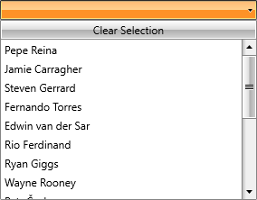
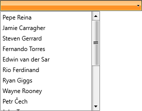
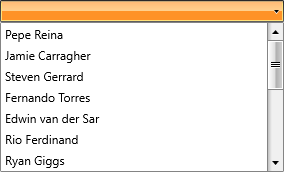

# Controlling Appearance

The __RadComboBox__ control gives you a number of [properties](#available-properties) to customize its look and feel. If you need to further modify the appearance, you can modify its [control templates](#editing-control-templates) to your liking.

## Available Properties

Here's a list of the key properties you can use.

### ClearSelectionButtonVisibility

If you want to show the button clearing the selection of the __RadComboBox__, just set the __ClearSelectionButtonVisibility__ property to __Visibility.Visible__. In addition you need to set the **ClearSelectionButtonContent** property to a string of your choice.

#### __[XAML] Example 1: Clear selection button__

{{region xaml-radcombobox-styles-templates-controlling-appearance_1}}
	<telerik:RadComboBox ClearSelectionButtonVisibility="Visible" ClearSelectionButtonContent="Clear Selection" />
{{endregion}}

#### __Figure 1: ClearSelectionButtonVisibility set to Visibility.Visible__

### IsDropDownOpen

To open the __RadComboBox__'s drop-down initially, set the __IsDropDownOpen__ property to __True__.

#### __[XAML] Example 2: Open dropdown__

{{region xaml-radcombobox-styles-templates-controlling-appearance_2}}
	<telerik:RadComboBox IsDropDownOpen="True" />
{{endregion}}

### DropDownWidth

By default, the width of the dropdown is the same as that of its parent RadComboBox. To change this, set the **DropDownWidth** property to the desired width.

#### __[XAML] Example 3: Open dropdown__

{{region xaml-radcombobox-styles-templates-controlling-appearance_3}}
	<telerik:RadComboBox DropDownWidth="200" />
{{endregion}}

#### __Figure 2: Dropdown width__

### MaxDropDownHeight

To set the maximum height of the __RadComboBox__'s dropdown, specify its __MaxDropDownHeight__ property.

#### __[XAML] Example 4: Set maximum dropdown height__

{{region xaml-radcombobox-styles-templates-controlling-appearance_4}}
	<telerik:RadComboBox MaxDropDownHeight="150" />
{{endregion}}

#### __Figure 3: Maximum dropdown height__

### OpenDropDownOnFocus

To specify whether the drop-down should be opened or not when the control gets the focus, set the __OpenDropDownOnFocus__ property to __True__.

#### __[XAML] Example 5: Set maximum dropdown height__

{{region xaml-radcombobox-styles-templates-controlling-appearance_5}}
	<telerik:RadComboBox OpenDropDownOnFocus="True" />
{{endregion}}

### StaysOpenOnEdit

To specify whether an editable __RadComboBox__ that is opened (displays a drop-down control) will remain open once a user clicks the __TextBox__, set the __StaysOpenOnEdit__ property to __True__.

#### __[XAML] Example 6: Stays open on edit__

{{region xaml-radcombobox-styles-templates-controlling-appearance_6}}
	<telerik:RadComboBox StaysOpenOnEdit="True" />
{{endregion}}

### EmptyText

To specify the string that should be displayed in the selection box when there is no selection, set the **EmptyText** property.

#### __[XAML] Example 7: Stays open on edit__

{{region xaml-radcombobox-styles-templates-controlling-appearance_7}}
	<telerik:RadComboBox EmptyText="Select Players..." />
{{endregion}}

#### __Figure 4: Empty text string__

## Editing Control Templates

In order to modify the control template of RadComboBox you need to specify the **NonEditableTemplate** and **EditableTemplate** properties. The **NonEditableTemplate** is is the default  RadComboBox control template and is used by the control instead of the **Template** property.

As their names suggest, the NonEditableTemplate is used when the **IsEditable** property of the control is set to **False** and the EditableTemplate template is used otherwise.

#### __[XAML] Example 8: Use of custom templates__

{{region xaml-radcombobox-styles-templates-controlling-appearance_8}}
	
{{endregion}}

>For information on how to extract and edit these templates, please refer to the [Editing Control Templates]() article.

## See Also

* [Edit Modes]()
* [AutoComplete]()
* [Editing Control Templates]()
* [SelectionBoxTemplate]()
* [Clear Selection Button]()
* [TextBoxStyle]()

* [MultipleSelectionBoxTemplate](#multipleselectionboxtemplate)
