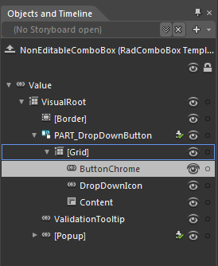
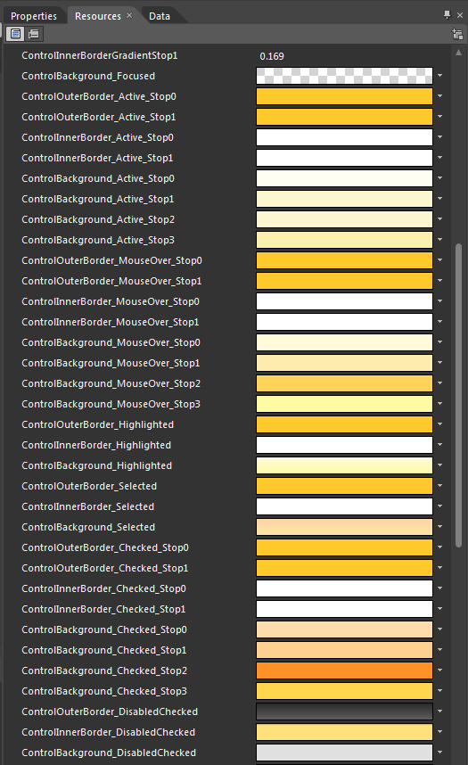
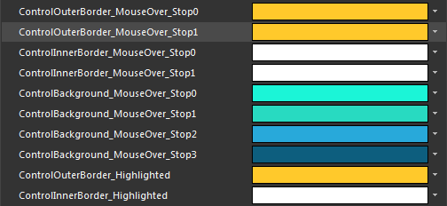
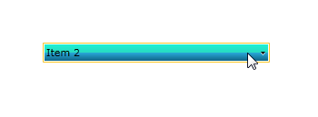
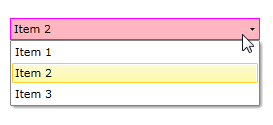

# Modifying Brushes

Modifying the appearance of RadComboBox or RadComboBoxItems is sometimes needed to make the control blend with your custom design. This article will explore two approaches in modifying brushes that are responsible for the visual states of RadComboBox or RadComboBoxItems.

You could try customizing the __ButtonChrome__ control, the sole purpose of which is to ensure consistency across controls and their themes. Another possible course of action is to replace the ButtonChrome control with your own visual elements and animate their VisualStates or Triggers to fit your design.

Find out how to:

* [Customize the ButtonChrome](#Customize_the_ButtonChrome)

* [Animate your own visual elements](#Animate_own_visual_elements)

## Customize the ButtonChrome

The ButtonChrome is an auxiliary themable control. It carries in its style all brushes related to each possible visual state, such as MouseOver, Highlighted, Pressed, Focused, etc. This means that whenever you wish to change a RadComboBox brush for any of its states, or that of another control which contains a ButtonChrome in its template, you need to customize the ButtonChrome.

The way to obtain the style for the ButtonChrome is very common. Open RadComboBox in Expression Blend and generate its default NonEditableTemplate by hitting *Object > Edit Template > Edit a Copy*. Inside the template you can drill down to find the ButtonChrome control:

Then generate ButtonChromeStyle again by hitting *Object > Edit Template > Edit a Copy*. Inside the template you can drill down to find the ButtonChrome control:

>Expression Blend will always generate styles for the default __Office Black theme__. If you are using another theme, you should manually copy the style, together with all resources it has a reference to, from RadControls installation folder on your machine. This folder contains a Themes folder in which you can find resources for RadComboBox or any other control according to the theme you use. 

Now that you have the entire ButtonChromeStyle at your disposal, you are free to modify any of its brushes. In Expression Blend open the Resources tab on the right and, while still in the newly generated ButtonChromeStyle, take a minute to explore the wide range of available brushes and find the ones you want to change.

>Please, note that generating RadComboBoxStyle and ButtonChomeStyle usually produces a few common brushes with the same name. Blend will not duplicate these brushes but will most likely alarm that there are some __Invalid XAML__ errors. Simply make sure all your brushes are placed before all styles to avoid any errors.

The Resources tab should display a list of resources simililar to the following image:

Let's try and change the MouseOver state, for example:

And the result:

## Animate your own visual elements

It is quite easy to modify the ButtonChrome brushes for RadComboBox using the above approach, but you will notice that the style does contain a lot of XAML mark-up. If you do not want to include the entire ButtonChromeStyle in your application, you can replace the ButtonChrome with other visual elements.

Once you generate the style for RadComboBox, you will find the ButtonChrome in the __PART_DropDownButton__ RadToggleButton:

#### __XAML__

{{region radcombobox-styles-templates-modifying-brushes_0}}
			<telerik:RadToggleButton x:Name="PART_DropDownButton" ClickMode="Press" Foreground="{TemplateBinding Foreground}" IsTabStop="False" Margin="0" Padding="0" telerik:StyleManager.Theme="{StaticResource Theme}">
				...
					<Telerik_Windows_Controls_Chromes:ButtonChrome x:Name="ButtonChrome" BorderBrush="{TemplateBinding BorderBrush}" BorderThickness="{TemplateBinding BorderThickness}" Grid.ColumnSpan="2" CornerRadius="{StaticResource SplitButton_SpanCornerRadius}" RenderPressed="{TemplateBinding IsDropDownOpen}" RenderFocused="{TemplateBinding IsFocused}" telerik:StyleManager.Theme="{StaticResource Theme}" Style="{StaticResource ButtonChromeStyle1}"/>
				...
			</telerik:RadToggleButton>
	{{endregion}}

Replace the ButtonChrome  with any visual elements needed to build your UI and to implement all needed visual states.

>Please, note that you must not animate the same property of the same visual element in different VisualStates. Therefore in the template you should include a separate element for each visual state.

#### __XAML__

{{region radcombobox-styles-templates-modifying-brushes_1}}
			<telerik:RadToggleButton x:Name="PART_DropDownButton" ClickMode="Press" Foreground="{TemplateBinding Foreground}" IsTabStop="False" Margin="0" Padding="0" telerik:StyleManager.Theme="{StaticResource Theme}">
				...
	
				<Border x:Name="NormalBackground" Background="{StaticResource MyNormal_BackgroundBrush}" Grid.ColumnSpan="2" 
							 BorderBrush="{StaticResource MyNormal_BorderBrush}" BorderThickness="{TemplateBinding BorderThickness}" />
				<Border x:Name="MouseOverBackground" Background="{StaticResource MyMouseOver_BackgroundBrush}" Grid.ColumnSpan="2" Visibility="Collapsed"
							 BorderBrush="{StaticResource MyMouseOver_BorderBrush}" BorderThickness="{TemplateBinding BorderThickness}" />
				<Border x:Name="DropDownBackground" Background="{StaticResource MyDropDown_BackgroundBrush}" Grid.ColumnSpan="2" Visibility="Collapsed"
							  BorderBrush="{StaticResource MyDropDown_BorderBrush}" BorderThickness="{TemplateBinding BorderThickness}" />
				...
			</telerik:RadToggleButton>
	
	{{endregion}}



#### __XAML__

{{region radcombobox-styles-templates-modifying-brushes_2}}
			<VisualStateManager.VisualStateGroups>
				<VisualStateGroup x:Name="CommonStates">
					...
					<VisualState x:Name="MouseOver">
						<Storyboard>
							<ObjectAnimationUsingKeyFrames Storyboard.TargetProperty="Visibility" Storyboard.TargetName="NormalBackground">
								<DiscreteObjectKeyFrame KeyTime="0:0:0">
									<DiscreteObjectKeyFrame.Value>
										<Visibility>Collapsed</Visibility>
									</DiscreteObjectKeyFrame.Value>
								</DiscreteObjectKeyFrame>
							</ObjectAnimationUsingKeyFrames>
							<ObjectAnimationUsingKeyFrames Storyboard.TargetProperty="Visibility" Storyboard.TargetName="MouseOverBackground">
								<DiscreteObjectKeyFrame KeyTime="0:0:0">
									<DiscreteObjectKeyFrame.Value>
										<Visibility>Visible</Visibility>
									</DiscreteObjectKeyFrame.Value>
								</DiscreteObjectKeyFrame>
							</ObjectAnimationUsingKeyFrames>
							<ObjectAnimationUsingKeyFrames Storyboard.TargetProperty="Foreground" Storyboard.TargetName="DropDownIcon">
								<DiscreteObjectKeyFrame KeyTime="0" Value="{StaticResource ButtonIconForeground_MouseOver}"/>
							</ObjectAnimationUsingKeyFrames>
							<ObjectAnimationUsingKeyFrames Storyboard.TargetProperty="Background" Storyboard.TargetName="DropDownIcon">
								<DiscreteObjectKeyFrame KeyTime="0" Value="{StaticResource ButtonIconBackground_MouseOver}"/>
							</ObjectAnimationUsingKeyFrames>
						</Storyboard>
					</VisualState>
					<VisualState x:Name="DropDownOpen">
						<Storyboard>
							<ObjectAnimationUsingKeyFrames Storyboard.TargetProperty="Visibility" Storyboard.TargetName="NormalBackground">
								<DiscreteObjectKeyFrame KeyTime="0:0:0">
									<DiscreteObjectKeyFrame.Value>
										<Visibility>Collapsed</Visibility>
									</DiscreteObjectKeyFrame.Value>
								</DiscreteObjectKeyFrame>
							</ObjectAnimationUsingKeyFrames>
							<ObjectAnimationUsingKeyFrames Storyboard.TargetProperty="Visibility" Storyboard.TargetName="DropDownBackground">
								<DiscreteObjectKeyFrame KeyTime="0:0:0">
									<DiscreteObjectKeyFrame.Value>
										<Visibility>Visible</Visibility>
									</DiscreteObjectKeyFrame.Value>
								</DiscreteObjectKeyFrame>
							</ObjectAnimationUsingKeyFrames>
							<ObjectAnimationUsingKeyFrames Storyboard.TargetProperty="Foreground" Storyboard.TargetName="DropDownIcon">
								<DiscreteObjectKeyFrame KeyTime="0" Value="{StaticResource ButtonIconForeground_Pressed}"/>
							</ObjectAnimationUsingKeyFrames>
							<ObjectAnimationUsingKeyFrames Storyboard.TargetProperty="Background" Storyboard.TargetName="DropDownIcon">
								<DiscreteObjectKeyFrame KeyTime="0" Value="{StaticResource ButtonIconBackground_Pressed}"/>
							</ObjectAnimationUsingKeyFrames>
						</Storyboard>
					</VisualState>
				</VisualStateGroup>
				...
			</VisualStateManager.VisualStateGroups>
	
	{{endregion}}



Now that all visual elements, visual states or triggers and new brushes are in place, the customized RadComboBox looks like this:

When you try to change RadComboBox brushes and states, you can choose either approach. There is no specific reason to choose one over the other, it really depends on your requirements and preferences. Using the ButtonChrome will be less time-consuming and will also produce a reusable style that you can have in store whenever you wish to create another RadComboBox with the same style or even customize another ButtonChrome-based control in your application. A custom ButtonChrome style will make up for a good level of consistency in your application.

On the other hand, the style is lengthy and you will rarely ever need the entire style for the purpose of your customizations. In such cases, it would be better to include in RadComboBox style your own visual elements and animate them as needed. This will keep your RadComboBox style short, tidy and easy to read. 
