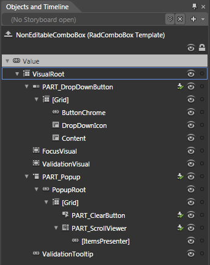

# Template Structure

Like most SilverlightWPF controls, the __RadComboBox__also allows you to template it in order to change the control from the inside. Except for templating the whole control, you can template parts of it or even independent controls related to it. This topic will make you familiar with the __RadComboBox's__and the __RadComboBoxItem's__ template parts and statestriggers.

>tipFor more information about templating and how to modify the default templates of the __RadControls__read the common topics on this matter.

## RadComboBox Template Parts and StatesTriggers

There are two templates that get applied to the __RadComboBox__, depending on if it is in editable (__Editable__ template) or in non-editable state (__NonEditable__ template). These two templates are respectively set to the __EditableTemplate__ and __NonEditableTemplate__ properties. The __NonEditable__ template is the default one and is also set to the __Template__ property of the __RadComboBox__.

>When editing the default template for the __RadComboBox__,____the default style for the control will get generated. Both the __Editable__ and the __NonEditable__ templates will be generated with it and Expression Blend will bring you in editing one of them, depending on the value of the __IsEditable__ property.

>tipTo learn more about the __Editable RadComboBox__ take a look at [this]() topic.

To learn more about the template structure and the states triggers of each of the two templates read the sections below.

To see how to style the __RadCombBox__ control take a look at the Styling the RadComboBox topic, where the resources generated for the default style will be explained.

## RadComboBox NonEditable Template

This section will explain the structure of the __NonEditable__ template of the __RadComboBox__and the states triggers associated with it. Here is a snapshot of the template generated in Expression Blend.

         
      

* __VisualRoot__ - hosts the other controls in the template and is of type __Grid__.

* PART_DropDownButton - 

* [Grid]

* ButtonChrome

* DropDownIcon

* Content

* FocusVisual

* ValidationVisual

* PART_Popup

* PopupRoot

* [Grid]

* PART_ClearButton

* PART_ScrollViewer

## RadComboBox Editable Template

This section will explain the structure of the __Editable__ template of the __RadComboBox__and the states triggers associated with it. Here is a snapshot of the template generated in Expression Blend.

-Image of the Template in Blend.

-Explanation of each part of the template.

-Explanation of each state/trigger of the template.

-Link to the respective topic.

## RadComboBoxItem Parts and StatesTriggers

This section will explain the structure of the __RadComboBoxItem's__template and the states triggers associated with it. Here is a snapshot of the template generated in Expression Blend.

-Image of the Template in Blend.

-Explanation of each part of the template.

-Explanation of each state/trigger of the template.

-Link to the styling topic.
