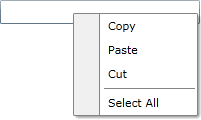
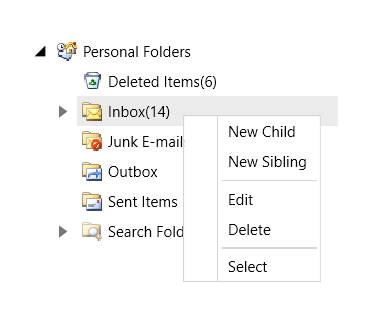

# Getting Started with {{ site.framework_name }} ContextMenu

This tutorial will walk you through the creation of a __RadContextMenu__ and will show you how to:

>Before reading this tutorial you should get familiar with the [Visual Structure]() of the standard __RadContextMenu__ control.

## Assembly References

To use the __RadContextMenu__ in your projects you have to add references to the following assemblies:

* __Telerik.Windows.Controls__
* __Telerik.Windows.Controls.Navigation__

You can find the required assemblies for each control from the suite in the [Controls Dependencies]()[Controls Dependencies]() help article.

### Adding Telerik Assemblies Using NuGet

To use __RadContextMenu__ when working with NuGet packages, install the `Telerik.Windows.Controls.Input.for.Wpf.Xaml` package. The [package name may vary]() slightly based on the Telerik dlls set - [Xaml or NoXaml]()

Read more about NuGet installation in the [Installing UI for WPF from NuGet Package]() article.

## Add RadContextMenu

In order to add a __RadContextMenu__ control to your __UserControl__ you have to declare the following namespace:

#### __[XAML] Example 1__

{{region xaml-contextmenu-getting-started_0}}
	xmlns:telerik="http://schemas.telerik.com/2008/xaml/presentation"
{{endregion}}

This tutorial will show you how to attach a __RadContextMenu__ to a TextBox control. Here is the TextBox control definition.

#### __[XAML] Example 2__

{{region xaml-contextmenu-getting-started_1}}
	<Grid x:Name="LayoutRoot"
	      Background="White">
	    <TextBox x:Name="InputBox"
	             Width="200"
	             VerticalAlignment="Top">
	    </TextBox>
	</Grid>
{{endregion}}

The next step is to set the __ContextMenu__ attached property of the __RadContextMenu__ class to the __TextBox__ control.


>*ContextMenu="{x:Null}"* is needed to override the default context menu of the textbox.

#### __[XAML] Example 3__

{{region xaml-contextmenu-getting-started_2}}
	<Grid Background="White">
	    <TextBox Width="200"
	             VerticalAlignment="Top"
	             ContextMenu="{x:Null}">
	        <telerik:RadContextMenu.ContextMenu>
	            <telerik:RadContextMenu />
	        </telerik:RadContextMenu.ContextMenu>
	    </TextBox>
	</Grid>
{{endregion}}



#### __[XAML] Example 3__

{{region xaml-contextmenu-getting-started_3}}
	<TextBox Width="200"
	         VerticalAlignment="Top"
	         ContextMenu="{x:Null}">
	    <telerik:RadContextMenu.ContextMenu>
	        <telerik:RadContextMenu>
	            <telerik:RadMenuItem Header="Copy" />
	            <telerik:RadMenuItem Header="Paste" />
	            <telerik:RadMenuItem Header="Cut" />
	            <telerik:RadMenuItem IsSeparator="True" />
	            <telerik:RadMenuItem Header="Select All" />
	        </telerik:RadContextMenu>
	    </telerik:RadContextMenu.ContextMenu>
	</TextBox>
{{endregion}}


If you run the application and right-click on the TextBox you will see an empty context menu.

#### __Figure 1__

## Add Menu Items

>The class that represents the menu item is __Telerik.Windows.Controls.RadMenuItem__. To learn more about it, please take a look at the [RadMenu help content]().

The __RadContextMenu__ accepts __RadMenuItems__ as child items. Here is a sample declaration of several child menu items.


#### __[XAML] Example 4__

{{region xaml-contextmenu-getting-started_5}}
	<TextBox Width="200"
	         VerticalAlignment="Top">
	    <telerik:RadContextMenu.ContextMenu>
	        <telerik:RadContextMenu>
	            <telerik:RadMenuItem Header="Copy" />
	            <telerik:RadMenuItem Header="Paste" />
	            <telerik:RadMenuItem Header="Cut" />
	            <telerik:RadMenuItem IsSeparator="True" />
	            <telerik:RadMenuItem Header="Select All" />
	        </telerik:RadContextMenu>
	    </telerik:RadContextMenu.ContextMenu>
	</TextBox>
{{endregion}}



#### __[XAML] Example 4__

{{region xaml-contextmenu-getting-started_3}}
	<TextBox Width="200"
	         VerticalAlignment="Top"
	         ContextMenu="{x:Null}">
	    <telerik:RadContextMenu.ContextMenu>
	        <telerik:RadContextMenu>
	            <telerik:RadMenuItem Header="Copy" />
	            <telerik:RadMenuItem Header="Paste" />
	            <telerik:RadMenuItem Header="Cut" />
	            <telerik:RadMenuItem IsSeparator="True" />
	            <telerik:RadMenuItem Header="Select All" />
	        </telerik:RadContextMenu>
	    </telerik:RadContextMenu.ContextMenu>
	</TextBox>
{{endregion}}


Here is a snapshot of the result.

#### __Figure 2__

## Populating the RadContextMenu with Data

The scenario described in the previous sections covers the usage of static items. To learn more about these type of scenarios read [here]().

However, in most of the cases you have to bind your __RadContextMenu__ to a collection of business objects. Check out the following topics which describe in details how to work with dynamic data.

* [Data Binding Support Overview]() - describes the various data sources for the __RadContextMenu__ and shows you many tips and tricks. Read this topics in order to achieve basic knowledge about how the binding mechanism works at the __RadContextMenu__. 

* [Binding to Dynamic Data]() - shows you how to bind the __RadContextMenu__ to a collection of business objects. 

* [Template and Styles Selectors]() - describes the possibilities to adjust the appearance of the __RadContextMenu's__ items depending on the data they hold. 

## Styles and Templates

Read the [Styles and Templates]() section which is entirely dedicated to styling and templating the __RadContextMenu__ control.

## Work with the RadContextMenu

In order to learn how to use the __RadContextMenu__ and what capabilities it holds, read the various topics that describe its features.

* [Working with the RadContextMenu]()

* [Opening on a Specific Event]()

* [Key Modifiers]()

* [Placement]()

* [Opening and Closing Delays]()

* [Data Binding]()

* [Boundaries Detection]()


## Setting a Theme

The controls from our suite support different themes. You can see how to apply a theme different than the default one in the [Setting a Theme]() help article.

>important Changing the theme using implicit styles will affect all controls that have styles defined in the merged resource dictionaries. This is applicable only for the controls in the scope in which the resources are merged. 

To change the theme, you can follow the steps below:

* Choose between the themes and add reference to the corresponding theme assembly (ex: **Telerik.Windows.Themes.Windows8.dll**). You can see the different themes applied in the **Theming** examples from our [WPF Controls Examples](https://demos.telerik.com/wpf/)[Silverlight Controls Examples](https://demos.telerik.com/silverlight/#ContextMenu/Theming) application.

* Merge the ResourceDictionaries with the namespace required for the controls that you are using from the theme assembly. For the __RadContextMenu__, you will need to merge the following resources:

	* __Telerik.Windows.Controls__
	* __Telerik.Windows.Controls.Navigation__

__Example 5__ demonstrates how to merge the ResourceDictionaries so that they are applied globally for the entire application.

#### __[XAML] Example 5: Merge the ResourceDictionaries__  
{{region xaml-radcontextmenu-getting-started_7}}
	<Application.Resources>
		<ResourceDictionary>
			<ResourceDictionary.MergedDictionaries>
				<ResourceDictionary Source="/Telerik.Windows.Themes.Windows8;component/Themes/System.Windows.xaml"/>
				<ResourceDictionary Source="/Telerik.Windows.Themes.Windows8;component/Themes/Telerik.Windows.Controls.xaml"/>
				<ResourceDictionary Source="/Telerik.Windows.Themes.Windows8;component/Themes/Telerik.Windows.Controls.Navigation.xaml"/>
			</ResourceDictionary.MergedDictionaries>
		</ResourceDictionary>
	</Application.Resources>
{{endregion}}

>Alternatively, you can use the theme of the control via the [StyleManager](https://docs.telerik.com/devtools/wpf/styling-and-appearance/stylemanager/common-styling-apperance-setting-theme-wpf)[StyleManager](https://docs.telerik.com/devtools/silverlight/styling-and-appearance/stylemanager/common-styling-apperance-setting-theme).

__Figure 3__ shows a __RadContextMenu__ with the **Windows8** theme applied.
	
#### __Figure 3: RadContextMenu with the Windows8 theme__


## Telerik UI for WPF Learning Resources

* [Telerik UI for WPF ContextMenu Component](https://www.telerik.com/products/wpf/contextmenu.aspx)
* [Getting Started with Telerik UI for WPF Components]()
* [Telerik UI for WPF Installation]()
* [Telerik UI for WPF and WinForms Integration]()
* [Telerik UI for WPF Visual Studio Templates]()
* [Setting a Theme with Telerik UI for WPF]()
* [Telerik UI for WPF Virtual Classroom (Training Courses for Registered Users)](https://learn.telerik.com/learn/course/external/view/elearning/16/telerik-ui-for-wpf) 
* [Telerik UI for WPF License Agreement](https://www.telerik.com/purchase/license-agreement/wpf-dlw-s)


## See Also

 * [Visual Structure]()

 * [Events - Overview]()

 * [Styles and Templates - Overview]()

 * [Use RadContextMenu with a RadGridView]()

 * [Select  the clicked Item of a RadTreeView]()

 * [Create Menu Button with RadContextMenu and ToggleButton]()

 * [Use Commands with the RadContextMenu]()

 * [Handle Item Clicks]()
