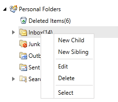

# Overview

## 





Thank you for choosing Telerik __RadContextMenu__!
        

Have you ever encountered the need of building a very complicated custom site menu system, while still keeping it simple for the end user? It’s easy to save space and provide additional commands or features with the __RadContextMenu__.
        

__RadContextMenu__ provides the power to boost the existing navigation of your application. Similar to RadMenu, __RadContextMenu__ allows you to combine the ability to display hierarchical views and the advanced styling mechanism, thus letting you build even the most complicated site-menu systems.
        

This is a list with short descriptions of the top-of-the-line features of Telerik's __RadContextMenu__ control:
        

* __Multi-level Menu Items__ - __RadContextMenu__ supports the displaying of hierarchical data. You can build any levels of menu items as needed to achieve the navigation you’d like. [Read More]()

* __Hierarchical Data Binding__ - the __RadContextMenu__ control allows you to bind and visualize sets of hierarchical data. You can also populate it by consuming data from XML files, WCF services, RIA services etc. [Read More]()

* __Opening on a Specific Event__ - you are able to specify the event that should trigger the __RadContextMenu__ opening. You can also specify a key, that should be pressed in combination with the event. [Read More]()

* __Styling and Appearance__ - __RadContextMenu__ control can be fully customized using Expression Blend. There are also several pre-defined themes that can be used to style the menu control. [Read More]()

* __Boundary Detection__ - __RadContextMenu__ detects the Silverlight plug-in boundaries and opens its child item-groups in the opposite direction when the screen boundaries are to be crossed. When there is not enough space in both directions, the control will adjust its items’ position in order to make them visible whenever this is possible. [Read More]()

* __WPF/Silverlight Code Compatibility__ - The WPF Menu shares a single codebase with its Silverlight counterpart. This means that you can achieve close to 100% code reuse for your Menu logic if you have parallel WPF/Silverlight development.
          

* __Codeless Test Automation for ContextMenu__ - now you can record, execute and debug functional tests for ComboBox without leaving the familiar Visual Studio environment. Telerik [WebUI Test Studio](http://www.telerik.com/products/web-testing-tools/webui-test-studio-features.aspx) is an advanced click and play web application testing tool specialized for automating both AJAX and Silverlight applications. The Studio ships with special translators for Telerik RadControls for ASP.NET AJAX and Silverlight.
          
