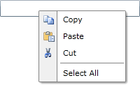

# Data Binding

Data binding allows you to establish a link between the UI and the underlying business logic and to keep them synchronized. This means that when a value is changed in the business layer, that change is automatically populated to the UI and vice versa. Of course, in order for this to work, you have to implement the proper notification or to use objects that have already implemented it.

__RadContextMenu__ can be used in two modes:

* __Data bound mode__ - set __RadContextMenu.ItemsSource__ and __RadContextMenu__ will automatically display the provided items.

* __Manual mode__ - add your items manually to the __RadContextMenu.Items__ collection.

## Inherit the Data Context

By default, the __RadContextMenu__ inherits the `DataContext` of its parent element. To prevent this behavior, set `InheritDataContext` to `False`.

__Prevent Data Context Inheritance__
```XAML
<telerik:RadContextMenu xmlns:telerik="http://schemas.telerik.com/2008/xaml/presentation"
                        InheritDataContext="False" />
```

## Supported Data Sources

You can bind __RadContextMenu__ to the following types of data sources:

* <a href="https://learn.microsoft.com/en-us/dotnet/api/system.collections.ienumerable" target="_blank">IEnumerable</a> - supports simple iteration of a collection. See the Microsoft Learn article for more information.

* <a href="https://learn.microsoft.com/en-us/dotnet/api/system.collections.icollection" target="_blank">ICollection</a> - extends <a href="https://learn.microsoft.com/en-us/dotnet/api/system.collections.ienumerable" target="_blank">IEnumerable</a> and supports size, enumerator, and synchronization methods for collections.

* <a href="https://learn.microsoft.com/en-us/dotnet/api/system.collections.ilist" target="_blank">IList</a> - extends <a href="https://learn.microsoft.com/en-us/dotnet/api/system.collections.icollection" target="_blank">ICollection</a> and is the base class for lists.

## Binding to a Collection

Set the __ItemsSource__ property to bind the __RadContextMenu__ to a collection exposed by the data context.

__Bind RadContextMenu to a Collection__
```XAML
<TextBox xmlns:telerik="http://schemas.telerik.com/2008/xaml/presentation"
		 Width="200"
		 ContextMenu="{x:Null}">
	<telerik:RadContextMenu.ContextMenu>
		<telerik:RadContextMenu ItemsSource="{Binding MenuItems}"
								DisplayMemberPath="Text" />
	</telerik:RadContextMenu.ContextMenu>
</TextBox>
```

The `MenuItems` collection is supplied by the data context of the view.

For each item in the collection, a container of type __RadMenuItem__ is created. By using the __ItemTemplate__, __ItemContainerStyle__ and __TemplateSelectors__ you can control the appearance of the dynamically created items. Besides the __ItemTemplate__ property, you could use the __DisplayMemberPath__ property, as shown above, for controlling the appearance of the created items.

>tip If neither the __DisplayMemberPath__ nor the __ItemTemplate__ are set, then the content of the item would be set to the value returned by the __ToString()__ method of the business object.

## Change Notification Support

If you want collection changes to appear automatically in the __RadMenuItems__, the collection must implement the __INotifyCollectionChanged__ interface. WPF provides a built-in collection that implements the __INotifyCollectionChanged__ interface: the generic __ObservableCollection<T>__. To get the full benefit from change notification, custom business objects must implement the __INotifyPropertyChanged__ interface.

>tip Consider using __ObservableCollection<T>__ or one of the other existing collection classes like __List<T>__, __Collection<T>__, instead of implementing your own collection. If the scenario requires a custom collection to be implemented, use the __IList__ interface, which provides individual access by index to its items and the best performance.

## Binding to Hierarchical Data

The data displayed in the __RadContextMenu__ can have a hierarchical structure (similar to the __RadTreeView__). This means that each item may come with a set of items on its own. For that reason you have to use the __ItemContainerStyle__. This section will walk you through the most important steps in creating, configuring and applying an __ItemContainerStyle__ to your __RadContextMenu__.

This tutorial uses the following sample class:

__Define the MenuItem Class__
```C#
public class MenuItem
{
    public MenuItem()
    {
        this.SubItems = new ObservableCollection<MenuItem>();
    }
    public string Text
    {
        get;
        set;
    }
    public Uri IconUrl
    {
        get;
        set;
    }
    public bool IsSeparator
    {
        get;
        set;
    }
    public ICommand Command
    {
        get;
        set;
    }
    public ObservableCollection<MenuItem> SubItems
    {
        get;
        set;
    }
}
```

The __MenuItem__ class holds the information for the menu items.

* __Text__: Represents the text value for the item.

* __IconUrl__: Represents the URL of the image that represents the icon of the menu item.

* __SubItems__: A collection of the sub menu items of the current menu item.

* __IsSeparator__: Indicates whether the item is a separator.

>tip To learn more about the separator items and the __RadMenuItems__, please take a look at the [RadMenu help content]().

Next, create a method to generate the sample data to populate the __RadContextMenu__:

__Generate Menu Items__
```C#
public ObservableCollection<MenuItem> GetMenuItems()
{
    ObservableCollection<MenuItem> items = new ObservableCollection<MenuItem>();
    MenuItem copyItem = new MenuItem()
    {
        IconUrl = new Uri("Images/copy.png", UriKind.Relative),
        Text = "Copy",
    };
    items.Add(copyItem);
    MenuItem pasteItem = new MenuItem()
    {
        IconUrl = new Uri("Images/paste.png", UriKind.Relative),
        Text = "Paste",
    };
    items.Add(pasteItem);
    MenuItem cutItem = new MenuItem()
    {
        IconUrl = new Uri("Images/cut.png", UriKind.Relative),
        Text = "Cut",
    };
    items.Add(cutItem);
    MenuItem separatorItem = new MenuItem()
    {
        IsSeparator = true
    };
    items.Add(separatorItem);
    MenuItem selectAllItem = new MenuItem()
    {
        Text = "Select All"
    };
    items.Add(selectAllItem);

    return items;
}
```

Finally, set the generated collection as the __ItemsSource__ of the control in the view constructor.

__Set the RadContextMenu ItemsSource__
```C#
public MainWindow()
{
    this.InitializeComponent();
    this.radContextMenu.ItemsSource = this.GetMenuItems();
}
```

The `ItemsSource` binding creates the menu items from the generated collection.

Here is a sample __Style__ used to visualize the items in the __RadContextMenu__ control.

__Define the Menu Item Style__
```XAML
<Style xmlns:telerik="http://schemas.telerik.com/2008/xaml/presentation" x:Key="MenuItemStyle" TargetType="telerik:RadMenuItem">
    <Setter Property="Icon" Value="{Binding IconUrl}"/>
    <Setter Property="IconTemplate">
        <Setter.Value>
            <DataTemplate>
                <Image Source="{Binding}" Stretch="None"/>
            </DataTemplate>
        </Setter.Value>
    </Setter>
    <Setter Property="IsSeparator" Value="{Binding IsSeparator}"/>
    <Setter Property="Header" Value="{Binding Text}"/>
    <Setter Property="ItemsSource" Value="{Binding SubItems}"/>
    <Setter Property="Command" Value="{Binding Command}"/>
</Style>
```

>tip If you use [NoXaml]() assemblies, set the BasedOn property to the default style: `BasedOn="{StaticResource RadMenuItemStyle}"`.

>note When setting the __ItemTemplate__ or __ItemContainerStyle__ properties of the __RadContextMenu__, they will get inherited in the hierarchy, unless they are not explicitly set.

In order to use the created style with the __RadContextMenu__ control, set its __ItemContainerStyle__ property.

__Apply the ItemContainerStyle__
```XAML
<TextBox xmlns:telerik="http://schemas.telerik.com/2008/xaml/presentation"
         Width="200" VerticalAlignment="Center" ContextMenu="{x:Null}">
    <telerik:RadContextMenu.ContextMenu>
        <telerik:RadContextMenu x:Name="radContextMenu" ItemContainerStyle="{StaticResource MenuItemStyle}" />
    </telerik:RadContextMenu.ContextMenu>
</TextBox>
```

The following image shows the final result.

__RadContextMenu Populated with Data__


## Adding Items Manually

To use manual mode, add __RadMenuItem__ objects to the __RadContextMenu__.

__Add RadMenuItems Manually__
```XAML
<telerik:RadContextMenu xmlns:telerik="http://schemas.telerik.com/2008/xaml/presentation">
	<telerik:RadMenuItem Header="Copy" />
	<telerik:RadMenuItem Header="Paste" />
</telerik:RadContextMenu>
```

## See Also

* [Attaching a Context Menu]()

* [Item Template and Style Selectors]()

* [Use Commands with the RadContextMenu]()