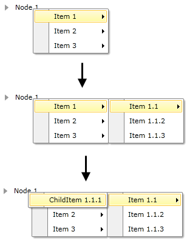

# Boundaries Detection

When you continuously open sub-menu items, you might face the situation when there is not enough space to open the next menu item. The __RadContextMenu__ control comes with a boundary detection functionality out of the box. This means that the __RadContextMenu__ detects the Silverlight plug-in's boundaries and opens the child items in the opposite direction when the screen boundaries are to be crossed. When there is not enough space in both directions, the control will adjust its items' position to make them visible wherever this is possible.

The following table demonstrates the RadContextMenu behavior when encounters a screen edge:

Placement	|	Top Edge	|	Bottom Edge	|	Left Edge	|	Right Edge
---	|	---	|	---	|	---	|	---
Absolute	|	Aligns to the top edge.	|	Aligns to the bottom edge.	|	Aligns to the left edge.	|	Aligns to the right edge.
AbsolutePoint	|	Aligns to the top edge.	|	The popup alignment point changes to the bottom-left corner of the RadContextMenu.	|	Aligns to the left edge.	|	The popup alignment point changes to the top-right corner of the RadContextMenu.
Bottom	|	Aligns to the top edge.	|	The target origin changes to the top-left corner of the target area and the popup alignment point changes to the bottom-left corner of the RadContextMenu.	|	Aligns to the left edge.	|	Aligns to the right edge.
Center	|	Aligns to the top edge.	|	Aligns to the bottom edge.	|	Aligns to the left edge.	|	Aligns to the right edge.
Left	|	Aligns to the top edge.	|	Aligns to the bottom edge.	|	The target origin changes to the top-right corner of the target area and the popup alignment point changes to the top-left corner of the RadContextMenu.	|	Aligns to the right edge.
Mouse	|	Aligns to the top edge.	|	The target origin changes to the top-left corner of the target area (the bounds of the mouse pointer) and the popup alignment point changes to the bottom-left corner of the RadContextMenu.	|	Aligns to the left edge.	|	Aligns to the right edge.
MousePoint	|	Aligns to the top edge.	|	The popup alignment point changes to the bottom-left corner of the RadContextMenu.	|	Aligns to the left edge.	|	The popup alignment point changes to the top-right corner of the popup.
Relative	|	Aligns to the top edge.	|	Aligns to the bottom edge.	|	Aligns to the left edge.	|	Aligns to the right edge.
RelativePoint	|	Aligns to the top edge.	|	The popup alignment point changes to the bottom-left corner of the RadContextMenu.	|	Aligns to the left edge.	|	The popup alignment point changes to the top-right corner of the popup.
Right	|	Aligns to the top edge.	|	Aligns to the bottom edge.	|	Aligns to the left edge.	|	The target origin changes to the top-left corner of the target area and the popup alignment point changes to the top-right corner of the RadContextMenu.
Top	|	The target origin changes to the bottom-left corner of the target area and the popup alignment point changes to the top-left corner of the RadContextMenu. In effect, this is the same as when Placement is Bottom.	|	Aligns to the bottom edge.	|	Aligns to the left edge.	|	Aligns to the right edge.

## See Also

 * [Visual Structure]()

 * [Working with the RadContextMenu]()

 * [Opening and Closing Delays]()
