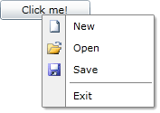

# Opening on a Specific Event

Setting the __EventName__ property will make __RadContextMenu__ to listen for a particular event. When this event occurs, the __RadContextMenu__ will open. For example, you may want to attach a context menu to a __Button__ and the context menu to open whenever the __Button__ gets clicked. This can be done by just setting the __EventName__ property to the name of the event, in this case "__Click__".

>tip__RadContextMenu__ can listen for any of the events of the control to which it is attached.

#### __XAML__

```XAML
	<Button Width="100"
	        Content="Click me!"
	        VerticalAlignment="Top">
	    <telerik:RadContextMenu.ContextMenu>
	        <telerik:RadContextMenu EventName="Click">
	            ...
	        </telerik:RadContextMenu>
	    </telerik:RadContextMenu.ContextMenu>
	</Button>
```

As you can see in this particular example, __RadContextMenu__ is listening for the __Click__ event of its host. So when you click the button, a context menu will appear.



## See Also

 * [Key Modifiers]()

 * [Placement]()

 * [Opening and Closing Delays]()
