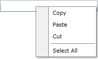

# Getting Started

This tutorial walks you through the creation of a __RadContextMenu__.

>note Before reading this tutorial you should get familiar with the [Visual Structure]() of the standard __RadContextMenu__ control.

## Adding Telerik Assemblies Using NuGet

To use __RadContextMenu__ when working with NuGet packages, install the `Telerik.Windows.Controls.Navigation.for.Wpf.Xaml` package. The [package name may vary]() slightly based on the Telerik dlls set - [Xaml or NoXaml]()

Read more about NuGet installation in the [Installing UI for WPF from NuGet Package]() article.

>tip With the 2025 Q1 release, the Telerik UI for WPF has a new licensing mechanism. Learn more in [Installing the License Key]().

## Adding Assembly References Manually

If you are not using NuGet packages, you can add a reference to the following assemblies:

* __Telerik.Licensing.Runtime__
* __Telerik.Windows.Controls__
* __Telerik.Windows.Controls.Navigation__

You can find the required assemblies for each control from the suite in the [Controls Dependencies]() help article.

## Attaching Context Menu to UI Element

In order to add a __RadContextMenu__ control to your __UserControl__ you have to declare the following namespace:

__Declare the Telerik Namespace__
```XAML
xmlns:telerik="http://schemas.telerik.com/2008/xaml/presentation"
```

This tutorial will show you how to attach a __RadContextMenu__ to a TextBox control. Here is the TextBox control definition.

__Define the TextBox__
```XAML
<Grid x:Name="LayoutRoot"
      Background="White">
    <TextBox x:Name="InputBox"
             Width="200"
             VerticalAlignment="Top">
    </TextBox>
</Grid>
```

The next step is to set the __ContextMenu__ attached property of the __RadContextMenu__ class to the __TextBox__ control.

>note *ContextMenu="{x:Null}"* is needed to override the default context menu of the textbox.

__Attach RadContextMenu to the TextBox__
```XAML
<Grid xmlns:telerik="http://schemas.telerik.com/2008/xaml/presentation"
    Background="White">
    <TextBox Width="200"
             VerticalAlignment="Top"
             ContextMenu="{x:Null}">
        <telerik:RadContextMenu.ContextMenu>
            <telerik:RadContextMenu />
        </telerik:RadContextMenu.ContextMenu>
    </TextBox>
</Grid>
```

If you run the application and right-click on the TextBox you will see an empty context menu.

__RadContextMenu with an Empty Context Menu__


## Adding Menu Items

>note The class that represents the menu item is __Telerik.Windows.Controls.RadMenuItem__. To learn more about it, please take a look at the [RadMenu help content]().

The __RadContextMenu__ accepts __RadMenuItems__ as child items. Here is a sample declaration of several child menu items.

__Define RadMenuItems__
```XAML
<TextBox xmlns:telerik="http://schemas.telerik.com/2008/xaml/presentation"
         Width="200"
         VerticalAlignment="Top"
         ContextMenu="{x:Null}">
    <telerik:RadContextMenu.ContextMenu>
        <telerik:RadContextMenu>
            <telerik:RadMenuItem Header="Copy" />
            <telerik:RadMenuItem Header="Paste" />
            <telerik:RadMenuItem Header="Cut" />
            <telerik:RadMenuItem IsSeparator="True" />
            <telerik:RadMenuItem Header="Select All" />
        </telerik:RadContextMenu>
    </telerik:RadContextMenu.ContextMenu>
</TextBox>
```

Here is a snapshot of the result.

__RadContextMenu with Menu Items__


## Populating the RadContextMenu with Data

The scenario described in the previous sections covers the usage of static items, declared directly in XAML.

However, in most of the cases you have to bind your __RadContextMenu__ to a collection of business objects. Check out the [Data Binding]() article which describes in detail how to work with dynamic data, including the supported data sources and the __ItemContainerStyle__ mechanism.

To adjust the appearance of the __RadContextMenu's__ items depending on the data they hold, read the [Item Template and Style Selectors]() article.

## Working with the RadContextMenu

In order to learn how to use the __RadContextMenu__ and what capabilities it holds, read the various topics that describe its features.

* [Setting the Opening Event]()

* [Keyboard Support]()

* [Menu Placement]()

* [Opening and Closing Delays]()

* [Data Binding]()

* [Item Template and Style Selectors]()

* [Context Menu Owner]()

* [Customizing the Icon Column]()

## Telerik UI for WPF Learning Resources

* [Telerik UI for WPF ContextMenu Component](https://www.telerik.com/products/wpf/contextmenu.aspx)
* [Getting Started with Telerik UI for WPF Components]()
* [Telerik UI for WPF Installation]()
* [Telerik UI for WPF and WinForms Integration]()
* [Telerik UI for WPF Visual Studio Templates]()
* [Setting a Theme with Telerik UI for WPF]()
* [Telerik UI for WPF Virtual Classroom (Training Courses for Registered Users)](https://learn.telerik.com/learn/course/external/view/elearning/16/telerik-ui-for-wpf)
* [Telerik UI for WPF License Agreement](https://www.telerik.com/purchase/license-agreement/wpf-dlw-s)

## See Also

* [Visual Structure]()

* [Events - Overview]()

* [Item Template and Style Selectors]()

* [Use RadContextMenu with a RadGridView]()

* [Select the Clicked Item of a RadTreeView]()

* [Create Menu Button with RadContextMenu and ToggleButton]()

* [Use Commands with the RadContextMenu]()

* [Handle Item Clicks]()

