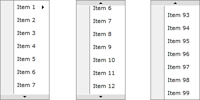
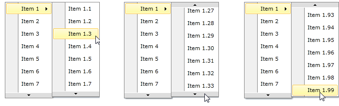
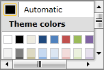

# Add Scrolling to RadContextMenu

Anytime you implement a RadContextMenu which displays a long list of items, or simply wish to limit the number of items visible in the menu, you can add scrolling functionality to RadContextMenu, and more specifically vertical scrolling. The process to do that is very simple and straightforward. This article will guide you through the process. 

## Use Height and DropDownHeight properties      

__RadContextMenu__ has Height property. If you set it, but the __RadMenuItems__ inside it doesn't fit in this size, you will see two buttons which can be used to scroll through your collection:



But if any of your __RadMenuItems__ has submenu items, they will be placed inside another popup. That's why we've added *DropDownHeight* property for __RadMenuItem__. The value of the property shows the height of RadMenuItem's submenu. The behavior when the items doesn't fit in the set DropDownHeight is the same as described above:



Here's a simple code that shows how to use Height and DropDownHeight properties:


```XAML
	<telerik:RadContextMenu.ContextMenu>
	    <telerik:RadContextMenu x:Name="radContextMenu" Height="200">
	        <telerik:RadMenuItem Header="Item 1" DropDownHeight="200">
	            <telerik:RadMenuItem Header="Item 1.1"/>
	            <telerik:RadMenuItem Header="Item 1.2"/>
	            <!--Define all items -->
	        </telerik:RadMenuItem>
	        <telerik:RadMenuItem Header="Item 2"/>
	        <!--Define all items -->
	    </telerik:RadContextMenu>
	</telerik:RadContextMenu.ContextMenu>
```

## Scrolling in RadMenuGroupItem

If you are using __RadMenuGroupItem__ you can control scrolling inside it via ScrollViewer's attached properties - VerticalScrollBarVisibility and HorizontalScrollBarVisibility.


```XAML
	<telerik:RadContextMenu x:Name="ContextMenu1">
	    <telerik:RadMenuGroupItem Height="100" Width="150" ScrollViewer.HorizontalScrollBarVisibility="Visible" ScrollViewer.VerticalScrollBarVisibility="Visible">
	        <telerik:RadColorSelector/>
	    </telerik:RadMenuGroupItem>
	</telerik:RadContextMenu>
	</telerik:RadContextMenu.ContextMenu>
```


