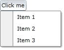

# Create Menu Button with RadContextMenu and ToggleButton

In some scenarios you need to have a button that displays additional options upon clicking. This tutorial will show you how to achieve such drop-down button behavior using only a __ToggleButton__ and a __RadContextMenu__. The two things you have to do are the following:

* Attach a __RadContextMenu__ to the __ToggleButton__

* Bind the __IsChecked__ property of the __ToggleButton__ to the __IsOpen__ property of the __RadContextMenu__

Here is the final code snippet.


```XAML
	<ToggleButton Content="Click me"
	              HorizontalAlignment="Left"
	              IsChecked="{Binding IsOpen, ElementName=radContextMenu, Mode=TwoWay}">
	    <telerik:RadContextMenu.ContextMenu>
	        <telerik:RadContextMenu x:Name="radContextMenu" Placement="Bottom">
	            <telerik:RadMenuItem Header="Item 1" />
	            <telerik:RadMenuItem Header="Item 2" />
	            <telerik:RadMenuItem Header="Item 3" />
	        </telerik:RadContextMenu>
	    </telerik:RadContextMenu.ContextMenu>
	</ToggleButton>
```

The things you have to make attention to here are: how the __RadContextMenu__ is attached to the __ToggleButton__ and the __ElementBinding__ applied to the __ToggleButton's__ __IsChecked__ property.



## See Also

 * [Working with the RadContextMenu]()

 * [Placement]()

 * [Use RadContextMenu with a RadGridView]()

 * [Select  the clicked Item of a RadTreeView]()

 * [Use Commands with the RadContextMenu]()

 * [Handle Item Clicks]()
