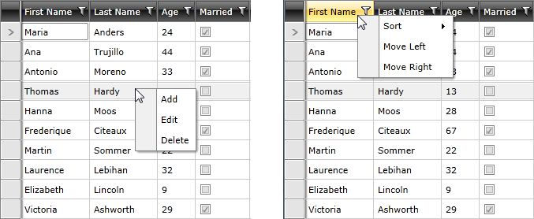

# Use RadContextMenu within RadGridView

This tutorial will demonstrate how to use a **RadContextMenu** to add functionality to the **RadGridView** control. The article is divided into the following sections:

* [Attach RadContextMenu to RadGridView](#attach-radcontextmenu-to-radgridview)
* [Configure the ItemContainerStyle for RadContextMenu](#configure-the-itemcontainerstyle-for-radcontextmenu)
* [Display Different Menu Items Depending on Which RadGridView Part Is Clicked](#display-different-menu-items-depending-on-which-radgridview-part-is-clicked)
* [Handle the Menu Items' Clicks](#handle-the-menu-items-clicks)

> You can have a look at the **Row Context Menu** and **Header Context Menu** demos which can be found in the RadGridView section of the [WPF Controls Examples](https://demos.telerik.com/wpf/)[Silverlight Controls Examples](https://demos.telerik.com/silverlight/). 

To start, first define a RadGridView, which will display a list of __Employee__ objects.

__Example 1: RadGridView definition__

```XAML
	<telerik:RadGridView x:Name="radGridView" AutoGenerateColumns="False">
	    <telerik:RadGridView.Columns>
	        <telerik:GridViewDataColumn DataMemberBinding="{Binding FirstName}" Header="First Name"/>
	        <telerik:GridViewDataColumn DataMemberBinding="{Binding LastName}" Header="Last Name"/>
	        <telerik:GridViewDataColumn DataMemberBinding="{Binding Age}" Header="Age"/>
	        <telerik:GridViewDataColumn DataMemberBinding="{Binding IsMarried}" Header="Married"/>
	    </telerik:RadGridView.Columns>
	</telerik:RadGridView>
```

## Attach RadContextMenu to RadGridView

In order to add a RadContextMenu to the RadGridView control, you have to just set the __RadContextMenu.ContextMenu__ attached property.

__Example 2: Add RadContextMenu to RadGridView__

```XAML
	<telerik:RadGridView x:Name="radGridView1" AutoGenerateColumns="False">
	    <telerik:RadContextMenu.ContextMenu>
	        <telerik:RadContextMenu x:Name="GridContextMenu" />
	    </telerik:RadContextMenu.ContextMenu>
	    <telerik:RadGridView.Columns>
	        <telerik:GridViewDataColumn DataMemberBinding="{Binding FirstName}" Header="First Name"/>
	        <telerik:GridViewDataColumn DataMemberBinding="{Binding LastName}" Header="Last Name"/>
	        <telerik:GridViewDataColumn DataMemberBinding="{Binding Age}" Header="Age"/>
	        <telerik:GridViewDataColumn DataMemberBinding="{Binding IsMarried}" Header="Married"/>
	    </telerik:RadGridView.Columns>
	</telerik:RadGridView>
```

## Configure the ItemContainerStyle for RadContextMenu

The __RadContextMenu__ will be populated with dynamic data, so you have to prepare an __ItemContainerStyle__ that will display this data. The business object that will represent the data is defined in **Example 3**.

__Example 3: The MenuItem class__

```C#
	public class MenuItem : INotifyPropertyChanged
	{
	    private bool isEnabled = true;
	    private string text;
	    private ObservableCollection<MenuItem> subItems;
	    public event PropertyChangedEventHandler PropertyChanged;
	    public bool IsEnabled
	    {
	        get
	        {
	            return this.isEnabled;
	        }
	        set
	        {
	            if (this.isEnabled != value)
	            {
	                this.isEnabled = value;
	                this.OnNotifyPropertyChanged("IsEnabled");
	            }
	        }
	    }
	    public string Text
	    {
	        get
	        {
	            return this.text;
	        }
	        set
	        {
	            if (this.text != value)
	            {
	                this.text = value;
	                this.OnNotifyPropertyChanged("Text");
	            }
	        }
	    }
	    public ObservableCollection<MenuItem> SubItems
	    {
	        get
	        {
	            if (this.subItems == null)
	            {
	                this.subItems = new ObservableCollection<MenuItem>();
	            }
	            return this.subItems;
	        }
	        set
	        {
	            if (this.subItems != value)
	            {
	                this.subItems = value;
	                this.OnNotifyPropertyChanged("SubItems");
	            }
	        }
	    }
	    private void OnNotifyPropertyChanged(string ptopertyName)
	    {
	        if (this.PropertyChanged != null)
	        {
	            this.PropertyChanged(this, new PropertyChangedEventArgs(ptopertyName));
	        }
	    }
	}
```
```VB.NET
	Public Class MenuItem
	    Implements INotifyPropertyChanged
	
	    Private _isEnabled As Boolean = True
	    Private _text As String
	    Private _subItems As ObservableCollection(Of MenuItem)
	
	    Public Property IsEnabled() As Boolean
	        Get
	            Return Me._isEnabled
	        End Get
	        Set(value As Boolean)
	            If Me._isEnabled <> value Then
	                Me._isEnabled = value
	                Me.OnNotifyPropertyChanged("IsEnabled")
	            End If
	        End Set
	    End Property
	    Public Property Text() As String
	        Get
	            Return Me._text
	        End Get
	        Set(value As String)
	            If Me._text <> value Then
	                Me._text = value
	                Me.OnNotifyPropertyChanged("Text")
	            End If
	        End Set
	    End Property
	    Public Property SubItems() As ObservableCollection(Of MenuItem)
	        Get
	            If Me._subItems Is Nothing Then
	                Me._subItems = New ObservableCollection(Of MenuItem)()
	            End If
	            Return Me._subItems
	        End Get
	        Set(value As ObservableCollection(Of MenuItem))
	            If Me._subItems IsNot value Then
	                Me._subItems = value
	                Me.OnNotifyPropertyChanged("SubItems")
	            End If
	        End Set
	    End Property
	
	    Private Sub OnNotifyPropertyChanged(ByVal propertyName As String)
	        RaiseEvent PropertyChanged(Me, New PropertyChangedEventArgs(propertyName))
	    End Sub
	
	    Public Event PropertyChanged As PropertyChangedEventHandler Implements INotifyPropertyChanged.PropertyChanged
	End Class
```

Here is the __ItemContainerStyle__:

__Example 4: The ItemContainerStyle__

```XAML
	<Style x:Key="MenuItemContainerStyle" TargetType="telerik:RadMenuItem">
	    <Setter Property="Header" Value="{Binding Text}"/>
	    <Setter Property="ItemsSource" Value="{Binding SubItems}"/>
	    <Setter Property="IsEnabled" Value="{Binding IsEnabled}"/>
	</Style>
```

## Display Different Menu Items Depending on Which RadGridView Part Is Clicked

The __RadContextMenu__ should display different items, depending on which part of it is clicked. Here are the possible scenarios along with the list of items we will show for each one:

* __GridView Header__

	* Sort

		* Ascending

		* Descending

		* None

	* Move Left

	* Move Right

* __GridView Row__

	* Add

	* Edit

	* Delete

* __Anything Else__

	* Add

	* Edit (__Disabled__)

	* Delete (__Disabled__)

As you can see, two data sources have to be provided for the __RadContextMenu__ - one when a header is clicked and a separate one when a row is clicked. For that purpose, create two collection fields in your __UserControl__ as demonstrated in **Example 5**.

__Example 5: The two MenuItem collections__

```C#
	private ObservableCollection<MenuItem> headerContextMenuItems;
	private ObservableCollection<MenuItem> rowContextMenuItems;
```
```VB.NET
	Private headerContextMenuItems As ObservableCollection(Of MenuItem)
	Private rowContextMenuItems As ObservableCollection(Of MenuItem)
```

Now, initialize them by using methods similar to the ones demonstrated in **Example 6**.

__Example 6: The helper methods to populate the RadContextMenu__

```C#
	public RadGridViewIntegration()
	{
	    InitializeComponent();
	    this.radGridView.ItemsSource = RadGridViewSampleData.GetEmployees();
	
	    this.InitializeHeaderContextMenuItems();
	    this.InitializeRowContextMenuItems();
	}
	
	private void InitializeRowContextMenuItems()
	{
	    ObservableCollection<MenuItem> items = new ObservableCollection<MenuItem>();
	    MenuItem addItem = new MenuItem();
	    addItem.Text = "Add";
	    items.Add(addItem);
	    MenuItem editItem = new MenuItem();
	    editItem.Text = "Edit";
	    items.Add(editItem);
	    MenuItem deleteItem = new MenuItem();
	    deleteItem.Text = "Delete";
	    items.Add(deleteItem);
	    this.rowContextMenuItems = items;
	}
	private void InitializeHeaderContextMenuItems()
	{
	    ObservableCollection<MenuItem> headerItems = new ObservableCollection<MenuItem>();
	    ObservableCollection<MenuItem> sortItems = new ObservableCollection<MenuItem>();
	    MenuItem sortAscItem = new MenuItem();
	    sortAscItem.Text = "Ascending";
	    sortItems.Add(sortAscItem);
	    MenuItem sortDescItem = new MenuItem();
	    sortDescItem.Text = "Descending";
	    sortItems.Add(sortDescItem);
	    MenuItem sortNoneItem = new MenuItem();
	    sortNoneItem.Text = "None";
	    sortItems.Add(sortNoneItem);
	    MenuItem sortItem = new MenuItem();
	    sortItem.Text = "Sort";
	    sortItem.SubItems = sortItems;
	    headerItems.Add(sortItem);
	    MenuItem moveLeftItem = new MenuItem();
	    moveLeftItem.Text = "Move Left";
	    headerItems.Add(moveLeftItem);
	    MenuItem moveRightItem = new MenuItem();
	    moveRightItem.Text = "Move Right";
	    headerItems.Add(moveRightItem);
	    this.headerContextMenuItems = headerItems;
	}
```
```VB.NET
	Public Sub New()
	    InitializeComponent()
	    Me.radGridView.ItemsSource = EmployeeService.GetEmployees()
	    Me.InitializeHeaderContextMenuItems()
	    Me.InitializeRowContextMenuItems()
	End Sub
	Private Sub InitializeRowContextMenuItems()
	    Dim items As New ObservableCollection(Of MenuItem)()
	    Dim addItem As New MenuItem()
	    addItem.Text = "Add"
	    items.Add(addItem)
	    Dim editItem As New MenuItem()
	    editItem.Text = "Edit"
	    items.Add(editItem)
	    Dim deleteItem As New MenuItem()
	    deleteItem.Text = "Delete"
	    items.Add(deleteItem)
	    Me.rowContextMenuItems = items
	End Sub
	Private Sub InitializeHeaderContextMenuItems()
	    Dim headerItems As New ObservableCollection(Of MenuItem)()
	    Dim sortItems As New ObservableCollection(Of MenuItem)()
	    Dim sortAscItem As New MenuItem()
	    sortAscItem.Text = "Ascending"
	    sortItems.Add(sortAscItem)
	    Dim sortDescItem As New MenuItem()
	    sortDescItem.Text = "Descending"
	    sortItems.Add(sortDescItem)
	    Dim sortNoneItem As New MenuItem()
	    sortNoneItem.Text = "None"
	    sortItems.Add(sortNoneItem)
	    Dim sortItem As New MenuItem()
	    sortItem.Text = "Sort"
	    sortItem.SubItems = sortItems
	    headerItems.Add(sortItem)
	    Dim moveLeftItem As New MenuItem()
	    moveLeftItem.Text = "Move Left"
	    headerItems.Add(moveLeftItem)
	    Dim moveRightItem As New MenuItem()
	    moveRightItem.Text = "Move Right"
	    headerItems.Add(moveRightItem)
	    Me.headerContextMenuItems = headerItems
	End Sub
```

Next you will need two properties that will return the clicked row and the clicked header. Define them in your __UserControl__ as follows by using the [GetClickedElement](#get-the-clicked-element) method.

__Example 7: The ClickedHeader and ClickedRow helper properties__

```C#
	private GridViewHeaderCell ClickedHeader
	{
	    get
	    {
	        return this.GridContextMenu.GetClickedElement<GridViewHeaderCell>();
	    }
	}
	private GridViewRow ClickedRow
	{
	    get
	    {
	        return this.GridContextMenu.GetClickedElement<GridViewRow>();
	    }
	}
```
```VB.NET
	Private ReadOnly Property ClickedHeader() As GridViewHeaderCell
	    Get
	        Return Me.GridContextMenu.GetClickedElement(Of GridViewHeaderCell)()
	    End Get
	End Property
	Private ReadOnly Property ClickedRow() As GridViewRow
	    Get
	        Return Me.GridContextMenu.GetClickedElement(Of GridViewRow)()
	    End Get
	End Property
```

The last thing to do is to attach an event handler to the __Opened__ event of the __RadContextMenu__. There you can implement the logic around changing the __ItemsSource__ of the __RadContextMenu__ depending on the clicked element.

__Example 8: Attach the Opened event handler__

```XAML
	<telerik:RadContextMenu x:Name="GridContextMenu2"
	                        ItemContainerStyle="{StaticResource MenuItemContainerStyle}"
	                        Opened="GridContextMenu_Opened" />
```

__Example 9: The Opened event handler definition__

```C#
	private void GridContextMenu_Opened(object sender, RoutedEventArgs e)
	{
	    if (this.ClickedHeader != null)
	    {
	        this.GridContextMenu.ItemsSource = this.headerContextMenuItems;
	    }
	    else if (this.ClickedRow != null)
	    {
	        this.radGridView.SelectedItem = this.ClickedRow.DataContext;
	        foreach (var item in this.rowContextMenuItems)
	        {
	            item.IsEnabled = true;
	        }
	        this.GridContextMenu.ItemsSource = this.rowContextMenuItems;
	    }
	    else
	    {
	        foreach (var item in this.rowContextMenuItems)
	        {
	            if (!item.Text.Equals("Add"))
	            {
	                item.IsEnabled = false;
	            }
	        }
	        this.GridContextMenu.ItemsSource = this.rowContextMenuItems;
	    }
	}
```
```VB.NET
	Private Sub GridContextMenu_Opened(sender As Object, e As RoutedEventArgs)
	    If Me.ClickedHeader IsNot Nothing Then
	        Me.GridContextMenu.ItemsSource = Me.headerContextMenuItems
	    ElseIf Me.ClickedRow IsNot Nothing Then
	        Me.radGridView.SelectedItem = Me.ClickedRow.DataContext
	        For Each item As Object In Me.rowContextMenuItems
	            item.IsEnabled = True
	        Next
	        Me.GridContextMenu.ItemsSource = Me.rowContextMenuItems
	    Else
	        For Each item As Object In Me.rowContextMenuItems
	            If Not item.Text.Equals("Add") Then
	                item.IsEnabled = False
	            End If
	        Next
	        Me.GridContextMenu.ItemsSource = Me.rowContextMenuItems
	    End If
	End Sub
```

The result once you click on a row or header is illustrated in **Figure 1**.

#### Figure 1: RadContextMenu shown when clicking on row and header respectively



## Handle the Menu Items' Clicks

The last thing to do in this tutorial is to [handle the menu items' actions](). For this purpose, attach an event handler to the __ItemClick__ event of the __RadContextMenu__. In it, get the clicked item and, depending on its value, execute the appropriate code.

__Example 10: Attach the ItemClick event handler__

```XAML
	<telerik:RadContextMenu x:Name="GridContextMenu3"
	                        ItemContainerStyle="{StaticResource MenuItemContainerStyle}"
	                        Opened="GridContextMenu_Opened"
	                        ItemClick="GridContextMenu_ItemClick" />
```

__Example 11: The ItemClick event handler definition__

```C#
	private void GridContextMenu_ItemClick(object sender, Telerik.Windows.RadRoutedEventArgs e)
	{
	    MenuItem item = (e.OriginalSource as RadMenuItem).DataContext as MenuItem;
	    switch (item.Text)
	    {
	        case "Add":
	            this.radGridView.BeginInsert();
	            break;
	        case "Edit":
	            this.radGridView.BeginEdit();
	            break;
	        case "Delete":
	            this.radGridView.Items.Remove(this.radGridView.SelectedItem);
	            break;
	        case "Ascending":
	            this.radGridView.SortDescriptors.Clear();
	            this.radGridView.SortDescriptors.Add(new SortDescriptor()
	            {
	                Member = this.ClickedHeader.Column.UniqueName,
	                SortDirection = ListSortDirection.Ascending
	            });
	            break;
	        case "Descending":
	            this.radGridView.SortDescriptors.Clear();
	            this.radGridView.SortDescriptors.Add(new SortDescriptor()
	            {
	                Member = this.ClickedHeader.Column.UniqueName,
	                SortDirection = ListSortDirection.Descending
	            });
	            break;
	        case "None":
	            this.radGridView.SortDescriptors.Clear();
	            break;
	        case "Move Left":
	            if (this.ClickedHeader.Column.DisplayIndex > 0)
	                this.ClickedHeader.Column.DisplayIndex -= 1;
	            break;
	        case "Move Right":
	            if (this.ClickedHeader.Column.DisplayIndex < this.radGridView.Columns.Count - 1)
	                this.ClickedHeader.Column.DisplayIndex += 1;
	            break;
	    }
	}
```
```VB.NET
	Private Sub GridContextMenu_ItemClick(sender As Object, e As Telerik.Windows.RadRoutedEventArgs)
	    Dim item As MenuItem = TryCast((TryCast(e.OriginalSource, RadMenuItem)).DataContext, MenuItem)
	    Select Case item.Text
	        Case "Add"
	            Me.radGridView.BeginInsert()
	            Exit Select
	        Case "Edit"
	            Me.radGridView.BeginEdit()
	            Exit Select
	        Case "Delete"
	            Me.radGridView.Items.Remove(Me.radGridView.SelectedItem)
	            Exit Select
	        Case "Ascending"
	            Me.radGridView.SortDescriptors.Clear()
	            Me.radGridView.SortDescriptors.Add(New SortDescriptor With {
	                                               .Member = Me.ClickedHeader.Column.UniqueName,
	                                               .SortDirection = ListSortDirection.Ascending})
	            Exit Select
	        Case "Descending"
	            Me.radGridView.SortDescriptors.Clear()
	            Me.radGridView.SortDescriptors.Add(New SortDescriptor With {
	                                               .Member = Me.ClickedHeader.Column.UniqueName,
	                                               .SortDirection = ListSortDirection.Descending})
	            Exit Select
	        Case "None"
	            Me.radGridView.SortDescriptors.Clear()
	            Exit Select
	        Case "Move Left"
	            If Me.ClickedHeader.Column.DisplayIndex > 0 Then
	                Me.ClickedHeader.Column.DisplayIndex -= 1
	            End If
	            Exit Select
	        Case "Move Right"
	            If Me.ClickedHeader.Column.DisplayIndex < Me.radGridView.Columns.Count - 1 Then
	                Me.ClickedHeader.Column.DisplayIndex += 1
	            End If
	            Exit Select
	    End Select
	End Sub
```

## See Also

 * [Working with the RadContextMenu]()
 * [Handle Item Clicks]()
 * [Use Commands with the RadContextMenu]()
 * [Select  the clicked Item of a RadTreeView]()
