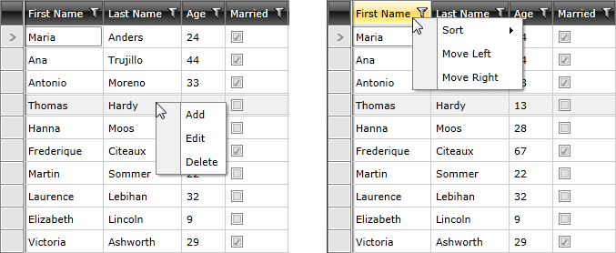

# Use RadContextMenu within RadGridView

This tutorial will demonstrate how to use a **RadContextMenu** to add functionality to the **RadGridView** control. The article is divided into the following sections:

* [Attach RadContextMenu to RadGridView](#attach-radcontextmenu-to-radgridview)
* [Configure the ItemContainerStyle for RadContextMenu](#configure-the-itemcontainerstyle-for-radcontextmenu)
* [Display Different Menu Items Depending on Which RadGridView Part Is Clicked](#display-different-menu-items-depending-on-which-radgridview-part-is-clicked)
* [Handle the Menu Items' Clicks](#handle-the-menu-items-clicks)

> You can have a look at the **Row Context Menu** and **Header Context Menu** demos which can be found in the RadGridView section of the [WPF Controls Examples](https://demos.telerik.com/wpf/)[Silverlight Controls Examples](https://demos.telerik.com/silverlight/). 

To start, first define a RadGridView, which will display a list of __Employee__ objects.

__Example 1: RadGridView definition__

<snippet id='radcontextmenu-how-to-use-radcontextmenu-with-radgridview-example_1_radgridview_definition-xaml' />

## Attach RadContextMenu to RadGridView

In order to add a RadContextMenu to the RadGridView control, you have to just set the __RadContextMenu.ContextMenu__ attached property.

__Example 2: Add RadContextMenu to RadGridView__

<snippet id='radcontextmenu-how-to-use-radcontextmenu-with-radgridview-example_2_add_radcontextmenu_to_radgridview-xaml' />

## Configure the ItemContainerStyle for RadContextMenu

The __RadContextMenu__ will be populated with dynamic data, so you have to prepare an __ItemContainerStyle__ that will display this data. The business object that will represent the data is defined in **Example 3**.

__Example 3: The MenuItem class__

<snippet id='radcontextmenu-how-to-use-radcontextmenu-with-radgridview-example_3_the_menuitem_class-cs' />

<snippet id='radcontextmenu-how-to-use-radcontextmenu-with-radgridview-example_3_the_menuitem_class-vb' />

Here is the __ItemContainerStyle__:

__Example 4: The ItemContainerStyle__

<snippet id='radcontextmenu-how-to-use-radcontextmenu-with-radgridview-example_4_the_itemcontainerstyle-xaml' />

## Display Different Menu Items Depending on Which RadGridView Part Is Clicked

The __RadContextMenu__ should display different items, depending on which part of it is clicked. Here are the possible scenarios along with the list of items we will show for each one:

* __GridView Header__

	* Sort

		* Ascending

		* Descending

		* None

	* Move Left

	* Move Right

* __GridView Row__

	* Add

	* Edit

	* Delete

* __Anything Else__

	* Add

	* Edit (__Disabled__)

	* Delete (__Disabled__)

As you can see, two data sources have to be provided for the __RadContextMenu__ - one when a header is clicked and a separate one when a row is clicked. For that purpose, create two collection fields in your __UserControl__ as demonstrated in **Example 5**.

__Example 5: The two MenuItem collections__

<snippet id='radcontextmenu-how-to-use-radcontextmenu-with-radgridview-example_5_the_two_menuitem_collections-cs' />

<snippet id='radcontextmenu-how-to-use-radcontextmenu-with-radgridview-example_5_the_two_menuitem_collections-vb' />

Now, initialize them by using methods similar to the ones demonstrated in **Example 6**.

__Example 6: The helper methods to populate the RadContextMenu__

<snippet id='radcontextmenu-how-to-use-radcontextmenu-with-radgridview-example_6_the_helper_methods_to_populate_the_radcontextmenu-cs' />

<snippet id='radcontextmenu-how-to-use-radcontextmenu-with-radgridview-example_6_the_helper_methods_to_populate_the_radcontextmenu-vb' />

Next you will need two properties that will return the clicked row and the clicked header. Define them in your __UserControl__ as follows by using the [GetClickedElement](#get-the-clicked-element) method.

__Example 7: The ClickedHeader and ClickedRow helper properties__

<snippet id='radcontextmenu-how-to-use-radcontextmenu-with-radgridview-example_7_the_clickedheader_and_clickedrow_helper_properties-cs' />

<snippet id='radcontextmenu-how-to-use-radcontextmenu-with-radgridview-example_7_the_clickedheader_and_clickedrow_helper_properties-vb' />

The last thing to do is to attach an event handler to the __Opened__ event of the __RadContextMenu__. There you can implement the logic around changing the __ItemsSource__ of the __RadContextMenu__ depending on the clicked element.

__Example 8: Attach the Opened event handler__

<snippet id='radcontextmenu-how-to-use-radcontextmenu-with-radgridview-example_8_attach_the_opened_event_handler-xaml' />

__Example 9: The Opened event handler definition__

<snippet id='radcontextmenu-how-to-use-radcontextmenu-with-radgridview-example_9_the_opened_event_handler_definition-cs' />

<snippet id='radcontextmenu-how-to-use-radcontextmenu-with-radgridview-example_9_the_opened_event_handler_definition-vb' />

The result once you click on a row or header is illustrated in **Figure 1**.

#### Figure 1: RadContextMenu shown when clicking on row and header respectively

## Handle the Menu Items' Clicks

The last thing to do in this tutorial is to [handle the menu items' actions](). For this purpose, attach an event handler to the __ItemClick__ event of the __RadContextMenu__. In it, get the clicked item and, depending on its value, execute the appropriate code.

__Example 10: Attach the ItemClick event handler__

<snippet id='radcontextmenu-how-to-use-radcontextmenu-with-radgridview-example_10_attach_the_itemclick_event_handler-xaml' />

__Example 11: The ItemClick event handler definition__

<snippet id='radcontextmenu-how-to-use-radcontextmenu-with-radgridview-example_11_the_itemclick_event_handler_definition-cs' />

<snippet id='radcontextmenu-how-to-use-radcontextmenu-with-radgridview-example_11_the_itemclick_event_handler_definition-vb' />

## See Also

 * [Working with the RadContextMenu]()
 * [Handle Item Clicks]()
 * [Use Commands with the RadContextMenu]()
 * [Select  the clicked Item of a RadTreeView]()
