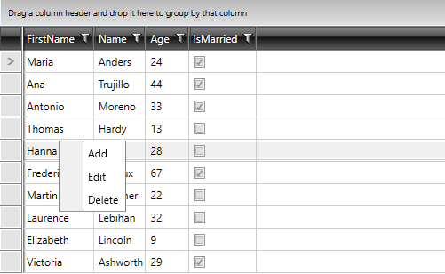
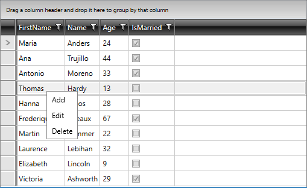

# Customizing the Icon Column

By default, the __RadContextMenu__ displays a column for the icons of its menu items. You can control the width of this column or hide it when the menu items do not use icons.

## Change the Icon Column Width

Use the `IconColumnWidth` property to control the width of the icon column. Set the value to `0` to hide the column.

__Set the Icon Column Width__
```XAML
<telerik:RadContextMenu xmlns:telerik="http://schemas.telerik.com/2008/xaml/presentation"
                        IconColumnWidth="0" />
```

__RadContextMenu Icon Column__


__RadContextMenu with Hidden Icon Column__


## See Also  
* [Data Binding]()
* [Item Template and Style Selectors]()
* [Menu Placement]()