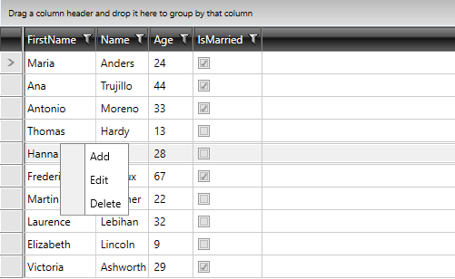
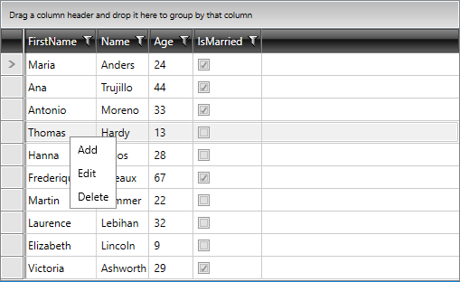
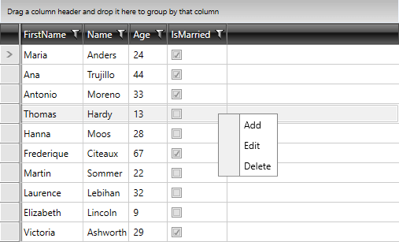

# Key Properties

This topic goes through the key properties of the `RadContextMenu` control.

## IconColumnWidth

By default, the RadContextMenu element displays a column used for visualizing the icons of the menu items. 


Its width can be controlled through the `IconColumnWidth` property. For example, it can be entirely hidden by setting the property value to 0.

__Setting the IconColumnWidth property__
```XAML
	 <telerik:RadContextMenu IconColumnWidth="0"/>
```

__RadContextMenu with hidden icon column__



## StaysOpen

Setting this property manipulates whether RadContextMenu will close automatically or not. Its default value is `False`. By setting it to `True`, the RadContextMenu control will stay open when the user clicks the menu items.

## HorizontalOffset

RadContextMenu provides a mechanism for controlling the horizontal distance between the target origin and the popup alignment point through the `HorizontalOffset` property.

__Setting the HorizontalOffset property__
```XAML
	<telerik:RadContextMenu HorizontalOffset="150"/>
```

__RadContextMenu with its HorizontalOffset property set__


 
## EventName

RadContextMenu can be opened only when a specific event is raised. `EventName` is the property through which the given event can be pointed to.

## ModifierKey

The `ModifierKey` property is used in conjunction with the `EventName` one. It is used when opening RadContextMenu only for a specific event is needed, but with a specified modifier key pressed as well. It is an enumeration type and has the following values.

## MousePosition

The `MousePosition` property provides information regarding the position of the mouse at the moment when the menu was opened relative to the element that caused its opening. It returns a `Point` value.

## UIElement

Returns the instance of the element to which RadContextMenu is attached.

## VerticalOffset

Similarly to the `HorizontalOffset` property, the `VerticalOffset` one provides a mechanism for setting the vertical distance between the target origin and the popup alignment point. 

## InheritDataContext

By default, the RadContextMenu inherits the DataContext of its parent element. If you want to avoid that, you can set the `InheritDataContext` property to `False`.

## RestoreFocusToTargetElement

When opened the RadContextMenu automatically gets the focus. To automatically return the focus back to the parent element that opened the context menu when the menu gets closed, set the `RestoreFocusToTargetElement` property to `True`.

__Setting the RestoreFocusToTargetElement property__
```XAML
	<telerik:RadContextMenu RestoreFocusToTargetElement="True"/>
```

## ShowKeyboardCuesOnOpen

The `ShowKeyboardCuesOnOpen` property allows you to control the visibility of the keyboard cues, when the RadContextMenu element is opened. The default value of this property is `null`. This means that the set access keys will automatically show when the menu is opened through the keyboard. Setting this property to `true` will always visualize the modifier keys when the RadContextMenu is opened through the keyboard or via a mouse. If the property is set to `false` the keyboard cues will not be shown.

>tip By setting the `ShowKeyboardCuesOnOpen` property to `true`, there will be no need to hold the `Alt` key when the RadContextMenu is opened via a mouse.

## See Also  
 * [Key Modifiers]()
 * [Opening on a Specific Event]()
 * [Placement]()
 * [Opening and Closing Delays]()

 * [MultiColumnComboBox and RestoreFocusToTargetElement]()

 
