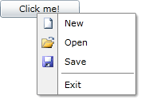

# Setting the Opening Event

Setting the __EventName__ property will make __RadContextMenu__ to listen for a particular event. When this event occurs, the __RadContextMenu__ will open. For example, you may want to attach a context menu to a __Button__ and the context menu to open whenever the __Button__ gets clicked. This can be done by just setting the __EventName__ property to the name of the event, in this case "__Click__".

>tip __RadContextMenu__ can listen for any of the events of the control to which it is attached.

__Open RadContextMenu on a Button Click__
```XAML
<Button xmlns:telerik="http://schemas.telerik.com/2008/xaml/presentation"
    Width="100"
        Content="Click me!"
        VerticalAlignment="Top">
    <telerik:RadContextMenu.ContextMenu>
        <telerik:RadContextMenu EventName="Click">
            <telerik:RadMenuItem Header="Item" />
        </telerik:RadContextMenu>
    </telerik:RadContextMenu.ContextMenu>
</Button>
```

As you can see in this particular example, __RadContextMenu__ is listening for the __Click__ event of its host. So when you click the button, a context menu will appear.

__RadContextMenu Opened on a Click Event__


## See Also

* [Keyboard Support]()

* [Menu Placement]()

* [Opening and Closing Delays]()
