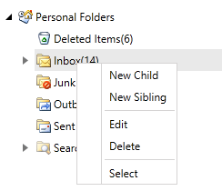

# Overview

Thank you for choosing __RadContextMenu__!

Have you ever encountered the need of building a very complicated custom menu system, while still keeping it simple for the end user? It is easy to save space and provide additional commands or features with the __RadContextMenu__.

__RadContextMenu__ provides the power to boost the existing navigation of your application. Similar to RadMenu, __RadContextMenu__ allows you to combine the ability to display hierarchical views and the advanced styling mechanism, thus letting you build even the most complicated menu systems.





__RadContextMenu Overview__

## Key Features

* __Multi-level Menu Items__: The control supports displaying hierarchical data. You can build multiple levels of menu items as needed to achieve the navigation you’d like. [Read More]()

* __Hierarchical Data Binding__: The control allows you to bind and visualize sets of hierarchical data. You can also populate it by consuming data from XML files, WCF services, RIA services etc. [Read More]()

* __Setting the Opening Event__: You are able to specify the event that should trigger the __RadContextMenu__ opening. You can also specify a key, that should be pressed in combination with the event. [Read More]()

* __Item Template and Style Selectors__: Adjust the appearance of the __RadContextMenu__'s items depending on the data they hold, by using template and style selectors. [Read More]()

* __UI Automation Support__: Check the [UI Automation Support]() common article.

* __Enhanced Routed Events Framework__: The events system of the control will help your code become even more elegant and concise.

>tip Get started with the control with its [Getting Started]() help article that shows how to use it in a basic scenario.

Check out our examples at [demos.telerik.com](https://demos.telerik.com/wpf/).

## Telerik UI for WPF Support and Learning Resources

* [Get Started with the Telerik UI for WPF ContextMenu]()
* [Telerik UI for WPF API Reference](https://docs.telerik.com/devtools/wpf/api/)
* [Getting Started with Telerik UI for WPF Components]()
* [Telerik UI for WPF Virtual Classroom (Training Courses for Registered Users)](https://learn.telerik.com/learn/course/external/view/elearning/16/telerik-ui-for-wpf)
* [Telerik UI for WPF ContextMenu Forums](https://www.telerik.com/forums/wpf)
* [Telerik UI for WPF Knowledge Base](https://docs.telerik.com/devtools/wpf/knowledge-base)

## Telerik UI for WPF Additional Resources

* [Telerik UI for WPF ContextMenu Homepage](https://www.telerik.com/products/wpf/contextmenu.aspx)
* [WPF Controls Examples](https://demos.telerik.com/wpf/)

## See Also

* [Visual Structure]()

* [Context Menu Owner]()

* [Menu Placement]()

* [Events]()
