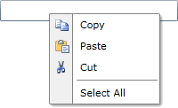

# Binding to Dynamic Data

The data displayed in the __RadContextMenu__ has a hierarchical structure (similar to the __RadTreeView__). This means that each item may come with a set of items on its own. For that reason you have to use the __ItemContainerStyle__. This tutorial will walk you through the most important steps in creating, configuring and applying __ItemContainerStyle__ to your __RadContextMenu__.

## Preparing the Data

This tutorial uses the following sample class:

__Example 1: The MenuItem class__

```C#
	public class MenuItem
	{
	    public MenuItem()
	    {
	        this.SubItems = new ObservableCollection<MenuItem>();
	    }
	    public string Text
	    {
	        get;
	        set;
	    }
	    public Uri IconUrl
	    {
	        get;
	        set;
	    }
	    public bool IsSeparator
	    {
	        get;
	        set;
	    }
	    public ICommand Command
	    {
	        get;
	        set;
	    }
	    public ObservableCollection<MenuItem> SubItems
	    {
	        get;
	        set;
	    }
	}
```
```VB.NET
	Public Class MenuItem
	    Public Sub New()
	        Me.SubItems = New ObservableCollection(Of MenuItem)()
	    End Sub
	    Public Property Text() As String
	    Public Property IconUrl() As Uri
	    Public Property IsSeparator() As Boolean
	    Public Property Command() As ICommand
	    Public Property SubItems() As ObservableCollection(Of MenuItem)
	End Class
```

The __MenuItem__ class holds the information for the menu items.

* __Text__: Represents the text value for the item.

* __IconUrl__: Represents the URL of the image that represents the icon of the menu item.

* __SubItems__: A collection of the sub menu items of the current menu item.

* __IsSeparator__: Indicates whether the item is a separator.

>tipTo learn more about the separator items and the __RadMenuItems__, please take a look at the [RadMenu help content]().

Next, we create a method to create the sample data to populate the RadContextMenu:

__Example 2: Generating menu items__

```C#
	public ObservableCollection<MenuItem> GetMenuItems()
	{
	    ObservableCollection<MenuItem> items = new ObservableCollection<MenuItem>();
	    MenuItem copyItem = new MenuItem()
	    {
	        IconUrl = new Uri("Images/copy.png", UriKind.Relative),
	        Text = "Copy",
	    };
	    items.Add(copyItem);
	    MenuItem pasteItem = new MenuItem()
	    {
	        IconUrl = new Uri("Images/paste.png", UriKind.Relative),
	        Text = "Paste",
	    };
	    items.Add(pasteItem);
	    MenuItem cutItem = new MenuItem()
	    {
	        IconUrl = new Uri("Images/cut.png", UriKind.Relative),
	        Text = "Cut",
	    };
	    items.Add(cutItem);
	    MenuItem separatorItem = new MenuItem()
	    {
	        IsSeparator = true
	    };
	    items.Add(separatorItem);
	    MenuItem selectAllItem = new MenuItem()
	    {
	        Text = "Select All"
	    };
	    items.Add(selectAllItem);
	
	    return items;
	}
```
```VB.NET
	Public Function GetMenuItems() As ObservableCollection(Of MenuItem)
	    Dim items As New ObservableCollection(Of MenuItem)()
	    Dim copyItem As New MenuItem() With {.IconUrl = New Uri("Images/copy.png", UriKind.Relative), .Text = "Copy"}
	    items.Add(copyItem)
	    Dim pasteItem As New MenuItem() With {.IconUrl = New Uri("Images/paste.png", UriKind.Relative), .Text = "Paste"}
	    items.Add(pasteItem)
	    Dim cutItem As New MenuItem() With {.IconUrl = New Uri("Images/cut.png", UriKind.Relative), .Text = "Cut"}
	    items.Add(cutItem)
	    Dim separatorItem As New MenuItem() With {.IsSeparator = True}
	    items.Add(separatorItem)
	    Dim selectAllItem As New MenuItem() With {.Text = "Select All"}
	    items.Add(selectAllItem)
	
	    Return items
	End Function
```

Finally, set the generated collection as the **ItemsSource** of the control.

__Example 3: Setting RadContextMenu's ItemsSource__

```C#
	    InitializeComponent();
	    this.radContextMenu.ItemsSource = this.GetMenuItems();
```
```VB.NET
	    InitializeComponent()
	    Me.radContextMenu.ItemsSource = Me.GetMenuItems()
```

## Creating and Applying the ItemContainerStyle

In order to visualize the data in the __RadContextMenu__ control you have to use a __ItemContainerStyle__ property. Here is a sample __Style__ used to visualize the items in the __RadContextMenu__ control.

__Example 4: The custom menu item style__  
```XAML
	<Style x:Key="MenuItemStyle" TargetType="telerik:RadMenuItem">
	    <Setter Property="Icon" Value="{Binding IconUrl}"/>
	    <Setter Property="IconTemplate">
	        <Setter.Value>
	            <DataTemplate>
	                <Image Source="{Binding}" Stretch="None"/>
	            </DataTemplate>
	        </Setter.Value>
	    </Setter>
	    <Setter Property="IsSeparator" Value="{Binding IsSeparator}"/>
	    <Setter Property="Header" Value="{Binding Text}"/>
	    <Setter Property="ItemsSource" Value="{Binding SubItems}"/>
	    <Setter Property="Command" Value="{Binding Command}"/>
	</Style>
```

>tip If you use [NoXaml]() assemblies, set the BasedOn property to the default style: `BasedOn="{StaticResource RadMenuItemStyle}"`.

>When setting the __ItemTemplate__ or __ItemContainerStyle__ properties of the __RadContextMenu__, they will get inherited in the hierarchy, unless they are not explicitly set.

In order to use the created style with __RadContextMenu__ control, you have to now set its __ItemContainerStyle__ property.

__Example 5: Setting the ItemContainerStyle__

```XAML
	<TextBox Width="200" VerticalAlignment="Center" ContextMenu="{x:Null}" >
	    <telerik:RadContextMenu.ContextMenu>
	        <telerik:RadContextMenu x:Name="radContextMenu" ItemContainerStyle="{StaticResource MenuItemStyle}" />
	    </telerik:RadContextMenu.ContextMenu>
	</TextBox>
```

**Figure 1** demonstrates the final result.

#### Figure 1: RadContextMenu populated with data



## See Also

 * [Data Binding Support Overview]()

 * [Using Static Items]()

 * [Template and Style Selectors]()

 * [Use Commands with the RadContextMenu]()