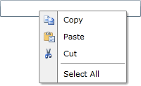

# Binding to Dynamic Data

The data displayed in the __RadContextMenu__ has a hierarchical structure (similar to the __RadTreeView__). This means that each item may come with a set of items on its own. For that reason you have to use the __ItemContainerStyle__. This tutorial will walk you through the most important steps in creating, configuring and applying __ItemContainerStyle__ to your __RadContextMenu__.

## Preparing the Data

This tutorial uses the following sample class:

__Example 1: The MenuItem class__

<snippet id='radcontextmenu-populating-with-data-binding-to-dynamic-data-example_1_the_menuitem_class-cs' />

<snippet id='radcontextmenu-populating-with-data-binding-to-dynamic-data-example_1_the_menuitem_class-vb' />

The __MenuItem__ class holds the information for the menu items.

* __Text__: Represents the text value for the item.

* __IconUrl__: Represents the URL of the image that represents the icon of the menu item.

* __SubItems__: A collection of the sub menu items of the current menu item.

* __IsSeparator__: Indicates whether the item is a separator.

>tip To learn more about the separator items and the __RadMenuItems__, please take a look at the [RadMenu help content]().

Next, we create a method to create the sample data to populate the RadContextMenu:

__Example 2: Generating menu items__

<snippet id='radcontextmenu-populating-with-data-binding-to-dynamic-data-example_2_generating_menu_items-cs' />

<snippet id='radcontextmenu-populating-with-data-binding-to-dynamic-data-example_2_generating_menu_items-vb' />

Finally, set the generated collection as the **ItemsSource** of the control.

__Example 3: Setting RadContextMenu's ItemsSource__

<snippet id='radcontextmenu-populating-with-data-binding-to-dynamic-data-example_3_setting_radcontextmenu_s_itemssource-cs' />

<snippet id='radcontextmenu-populating-with-data-binding-to-dynamic-data-example_3_setting_radcontextmenu_s_itemssource-vb' />

## Creating and Applying the ItemContainerStyle

In order to visualize the data in the __RadContextMenu__ control you have to use a __ItemContainerStyle__ property. Here is a sample __Style__ used to visualize the items in the __RadContextMenu__ control.

__Example 4: The custom menu item style__  
<snippet id='radcontextmenu-populating-with-data-binding-to-dynamic-data-example_4_the_custom_menu_item_style-xaml' />

>tip If you use [NoXaml]() assemblies, set the BasedOn property to the default style: `BasedOn="{StaticResource RadMenuItemStyle}"`.

>When setting the __ItemTemplate__ or __ItemContainerStyle__ properties of the __RadContextMenu__, they will get inherited in the hierarchy, unless they are not explicitly set.

In order to use the created style with __RadContextMenu__ control, you have to now set its __ItemContainerStyle__ property.

__Example 5: Setting the ItemContainerStyle__

<snippet id='radcontextmenu-populating-with-data-binding-to-dynamic-data-example_5_setting_the_itemcontainerstyle-xaml' />

**Figure 1** demonstrates the final result.

#### Figure 1: RadContextMenu populated with data

## See Also

 * [Data Binding Support Overview]()

 * [Using Static Items]()

 * [Template and Style Selectors]()

 * [Use Commands with the RadContextMenu]()