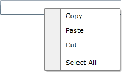

# Using Static Items

This tutorial will walk you through the common task of populating the __RadContextMenu__ with __RadMenuItems__ declaratively. 

Here is a regular __RadContextMenu__ declaration without items attached to a __TextBox__:



<snippet id='radcontextmenu-populating-with-data-using-static-items-block_1-xaml' />





<snippet id='radcontextmenu-populating-with-data-using-static-items-block_2-xaml' />



In order to add items you need to use the __RadContextMenu's Items__ property. The __Items__ property is an __ItemCollection__ which contains your __RadMenuItems__. For example, take a look at the following lines.



<snippet id='radcontextmenu-populating-with-data-using-static-items-block_3-xaml' />




<snippet id='radcontextmenu-populating-with-data-using-static-items-block_4-xaml' />



Here is a snapshot of the current result.

>tip Each of the __RadMenuItems__ can have child items, that are defined in the same way.

The __RadMenuItem__ exposes an __Icon__ property, which allows you to specify an icon for it. Here is an example.



<snippet id='radcontextmenu-populating-with-data-using-static-items-block_5-xaml' />





<snippet id='radcontextmenu-populating-with-data-using-static-items-block_6-xaml' />



>tip Consider declaring menu items in XAML instead of adding them by code whenever it's possible. This includes situations when you know what items you need at design time.

## See Also

 * [Data Binding Support Overview]()

 * [Working with the RadContextMenu]()

 * [Binding to Dynamic Data]()

 * [Template and Style Selectors]()

 * [Handle Item Clicks]()
