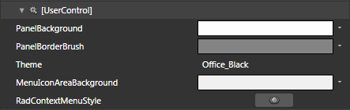
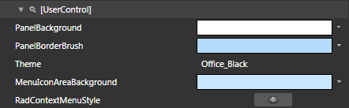
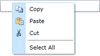

# Styling the RadContextMenu

>tip To learn about styling and templating the __RadMenuItem__, please take a look at the [Styles and Templates]() section of the __RadMenu's__ help.

The __RadContextMenu__ can be styled by creating an appropriate __Style__ and setting it to the __Style__ property of the control. 

You have two options:

* To create an empty style and set it up on your own.

* To copy the default style of the control and modify it.

This topic will show you how to perform the second one.

## Modifying the Default Style

To copy the default style, load your project in Expression Blend. As the attached __RadContextMenu__ is not visible in Expression Blend you have to use a dummy. From the 'Assets' pane select the __RadContextMenu__ control and draw one. In the 'Objects and Timeline' pane select it and from the menu choose *Object -> Edit Style -> Edit a Copy*. You will be prompted for the name of the style and where to be placed.

>tip If you choose to define the style in Application, it would be available for the entire application. This allows you to define a style only once and then reuse it where needed.

After clicking 'OK', Expression Blend will generate the default style of the __RadContextMenu__ control in the __Resources__ section of your User Control. The properties available for the style will be loaded in the 'Properties' pane and you will be able to modify their default values. You can also edit the generated XAML in the XAML View or in Visual Studio.

>tip After finishing with the style, you can set it to the desired __RadContextMenu__ control. Don't forget to delete the dummy you have drawn in the beginning.

If you go to the 'Resources' pane, you will see an editable list of resources generated together with the style and used by it. In this list you will find the brushes, styles and templates needed to change the visual appearance of the __RadContextMenu__. Their names indicate to which part of the __RadContextMenu__ appearance they are assigned.

* __PanelBackground__ - a brush that represents the background of the main content area.

* __PanelBorderBrush__ - a brush that represents the color of the __RadContextMenu's__ borders.

* __MenuIconAreaBackground__ - a brush that represents the background of the menu icon area.

* __RadContextMenuStyle__ - the default Style generated for the __RadContextMenu__.

>tip Changing the value of the resources can be done by clicking on the color indicator or the icon next to them.

Modify the resource to bring the desired appearance to the __RadContextMenu__. 

Here is a snapshot of the result.

## See Also

 * [Styles and Templates - Overview]()

 * [Template Structure]()

 * [Visual Structure]()
