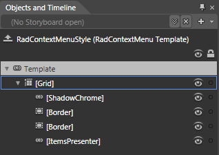

# Template Structure

Like most WPF controls, the __RadContextMenu__ also allows you to template it in order to change the control from the inside. Except for templating the whole control, you can template parts of it or even independent controls related to it.

>tipFor more information about templating and how to modify the default templates of the controls from the UI for WPF suite read [Editing Control Templates article]() on this matter.

## RadContextMenu Template Structure

This section explains the structure of the __RadContextMenu's__ template. Here is a snapshot of the template generated in Expression Blend.

It contains the following parts:

* __[Grid]__ - the layout root for the template and is of type __Border__. Visualizes the background and the border of the __RadMenu__.

	* __[ShadowChrome]__ - represents the shadow of the __RadContextMenu__ and is of type __ShadowChrome__.

	* __[Border]__ - represents the left column of the __RadContextMenu__ and is of type __Border__.

	* __[Border]__ - represents the background and the border of the main content and is of type __Border__.

	* __[ItemsPresenter]__ - represents the host control for the __RadMenu's__ items and is of type __ItemsPresenter__.

## See Also

 * [Styles and Templates - Overview]()

 * [Styling the RadContextMenu]()

 * [Visual Structure]()
