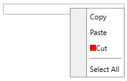
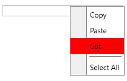

# Item Template and Style Selectors

The `RadContextMenu` and the `RadMenuItem` controls come with a set of selector properties. Typically, you use a template or style selector when you have more than one data template or style defined for the same type of objects.

The following example is based on the [Data Binding]() article.

Here is a list of the selectors provided by the RadContextMenu control:

* `ItemContainerTemplateSelector`&mdash;Used to select a DataTemplate, which needs to contain an element of the type of RadMenuItem that will be displayed in the RadContextMenu control.
* `ItemTemplateSelector`&mdash;Used to select the `DataTemplate` that is set as the `HeaderTemplate` property of the child RadMenuItem instances.

__Define the ItemTemplateSelector__
```C#
public class MyTemplateSelector : DataTemplateSelector
{
    public DataTemplate CutTemplate { get; set; }
    public DataTemplate DefaultTemplate { get; set; }

    public override DataTemplate SelectTemplate(object item, DependencyObject container)
    {
        var menuItem = item as MenuItem;
        if (menuItem != null && menuItem.Text == "Cut")
        {
            return this.CutTemplate;
        }
        return this.DefaultTemplate;
    }
}
```

__Using the ItemTemplateSelector in XAML__
```XAML
<Grid xmlns="http://schemas.microsoft.com/winfx/2006/xaml/presentation"
            xmlns:x="http://schemas.microsoft.com/winfx/2006/xaml"
            xmlns:telerik="http://schemas.telerik.com/2008/xaml/presentation"
      xmlns:local="clr-namespace:MyProject">
    <Grid.Resources>
                <x:Array x:Key="MenuItems" Type="{x:Type local:MenuItem}">
                        <local:MenuItem Text="Cut" />
                        <local:MenuItem Text="Copy" />
                </x:Array>
        <Style x:Key="MenuItemStyle" TargetType="telerik:RadMenuItem">
            <Setter Property="Header" Value="{Binding Text}" />
        </Style>
        <local:MyTemplateSelector x:Key="MyTemplateSelector">
            <local:MyTemplateSelector.CutTemplate>
                <DataTemplate>
                    <StackPanel Orientation="Horizontal">
                        <Rectangle Width="10" Height="10" Fill="Red" />
                        <TextBlock Text="{Binding Text}" />
                    </StackPanel>
                </DataTemplate>
            </local:MyTemplateSelector.CutTemplate>
            <local:MyTemplateSelector.DefaultTemplate>
                <DataTemplate>
                    <TextBlock Text="{Binding Text}" />
                </DataTemplate>
            </local:MyTemplateSelector.DefaultTemplate>
        </local:MyTemplateSelector>
    </Grid.Resources>
    <TextBox Width="200" VerticalAlignment="Top" ContextMenu="{x:Null}">
        <telerik:RadContextMenu.ContextMenu>
            <telerik:RadContextMenu x:Name="radContextMenu"
                                    ItemContainerStyle="{StaticResource MenuItemStyle}"
                                    ItemsSource="{StaticResource MenuItems}"
                                    ItemTemplateSelector="{StaticResource MyTemplateSelector}" />
        </telerik:RadContextMenu.ContextMenu>
    </TextBox>
</Grid>
```

__RadContextMenu with ItemTemplateSelector__


* `ItemContainerStyleSelector`&mdash;Used to select the __Style__ that is applied to the child __RadMenuItems__.

__Define the ItemContainerStyleSelector__
```C#
public class MyStyleSelector : StyleSelector
{
    public Style CutStyle { get; set; }
    public Style DefaultStyle { get; set; }

    public override Style SelectStyle(object item, DependencyObject container)
    {
        var menuItem = item as MenuItem;
        if (menuItem.Text == "Cut")
        {
            return this.CutStyle;
        }
        return this.DefaultStyle;
    }
}
```

__Use the ItemContainerStyleSelector in XAML__
```XAML
<Grid xmlns="http://schemas.microsoft.com/winfx/2006/xaml/presentation"
            xmlns:x="http://schemas.microsoft.com/winfx/2006/xaml"
            xmlns:telerik="http://schemas.telerik.com/2008/xaml/presentation"
      xmlns:local="clr-namespace:MyProject">
    <Grid.Resources>
                <x:Array x:Key="MenuItems" Type="{x:Type local:MenuItem}">
                        <local:MenuItem Text="Cut" />
                        <local:MenuItem Text="Copy" />
                </x:Array>
        <Style x:Key="MenuItemStyle" TargetType="telerik:RadMenuItem">
            <Setter Property="Header" Value="{Binding Text}" />
        </Style>
        <local:MyStyleSelector x:Key="MyStyleSelector" DefaultStyle="{StaticResource MenuItemStyle}">
            <local:MyStyleSelector.CutStyle>
                <Style TargetType="telerik:RadMenuItem" BasedOn="{StaticResource MenuItemStyle}">
                    <Setter Property="Background" Value="Red" />
                </Style>
            </local:MyStyleSelector.CutStyle>
        </local:MyStyleSelector>
    </Grid.Resources>
    <TextBox Width="200" VerticalAlignment="Top" ContextMenu="{x:Null}">
        <telerik:RadContextMenu.ContextMenu>
            <telerik:RadContextMenu x:Name="radContextMenu"
                                    ItemsSource="{StaticResource MenuItems}"
                                    ItemContainerStyleSelector="{StaticResource MyStyleSelector}" />
        </telerik:RadContextMenu.ContextMenu>
    </TextBox>
</Grid>
```

__RadContextMenu with ItemContainerStyleSelector__


And a list of the selectors provided by the RadMenuItem control:

* `HeaderTemplateSelector`&mdash;Used to select the DataTemplate that is set to its HeaderTemplate property.
* `ItemContainerStyleSelector`&mdash;Used to select the `Style` that is applied to the child RadMenuItem elements.
* `ItemContainerTemplateSelector`&mdash;Used to select a DataTemplate, which needs to contain an element of the type of RadMenuItem that will be displayed in the RadContextMenu control.
* `ItemTemplateSelector`&mdash;Used to select the DataTemplate that is set as the HeaderTemplate property of the child RadMenuItem instances.

>tip These properties of the RadMenuItem should be set through the `ItemContainerStyle` of the parent item. If you set the ItemContainerStyle property of the `RadContextMenu` only (valid for [dynamic data scenarios]()), it will get inherited in the hierarchy, unless it is not explicitly set somewhere.

The `HierarchicalDataTemplate` used with the `RadContextMenu` also exposes `ItemContainerStyleSelector` and `ItemTemplateSelector` properties.

## See Also

* [Data Binding]()

* [Attaching a Context Menu]()
