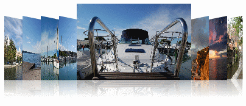
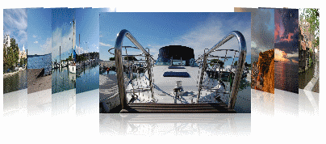

# CameraViewPoint

__CameraViewPoint__

The __CameraViewPoint__ property allows you to adjust angle from which you are viewing RadCoverFlow. You have three options to choose from - Top, Bottom and Center. Here is a quick example that shows the contrast between CameraViewPoint Bottom and Top.

#### __XAML__

{{region xaml-coverflow-camera_0}}
	<telerik:RadCoverFlow CameraViewPoint="Bottom" ...
{{endregion}}

#### __XAML__

{{region xaml-coverflow-camera_1}}
	<telerik:RadCoverFlow CameraViewPoint="Top" ...
{{endregion}}

