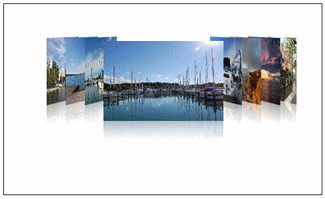
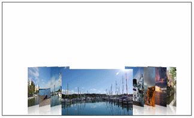

# Offsets

__Offsets__

The __OffsetY and OffsetX__ property allows you to move the images up and down the Y-axis and X-axis within the panel of the control. Both OffsetX and OffsetY are used as follows:

#### __XAML__

{{region xaml-coverflow-offsets_0}}
    <telerik:RadCoverFlow OffsetY="0"/>
{{endregion}}

#### __XAML__

{{region xaml-coverflow-offsets_1}}
    <telerik:RadCoverFlow OffsetY="120"/>
{{endregion}}

#### __XAML__

{{region xaml-coverflow-offsets_2}}
    <telerik:RadCoverFlow OffsetY="-60"/>
{{endregion}}

