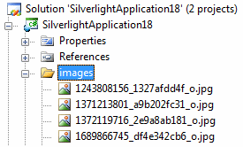

# Getting Started

>In order to use __RadCoverFlow__ control in your projects you have to add references to the following assemblies:
>	1. __Telerik.Windows.Controls__
>	1. __Telerik.Windows.Controls.Navigation__

You can find more info [here](http://www.telerik.com/help/silverlight/installation-installing-controls-dependencies.html)[here](http://www.telerik.com/help/wpf/installation-installing-controls-dependencies.html).

Before you create a __RadCoverFlow__ control, you have to make sure that you have added some images to display. You can also load the images on the fly using WCF or RIA service. Here is an example of images added in a project and declaration of the control:

Once you have your images added, creating a RadCoverFlow is straight-forward. Here is a XAML declaration of the control.

#### __XAML__

{{region xaml-coverflow-getting-started_0}}
	<telerik:RadCoverFlow Width="300" Height="300">
	 <Image Source="images/1371213801_a9b202fc31_o.jpg" Stretch="None" Width="100" Height="100"/>
	 <Image Source="images/1689886185_a282cccabb_o.jpg" Stretch="None" Width="100" Height="100"/>
	 <Image Source="images/1690737096_bd5d67c642_o.jpg" Stretch="None" Width="100" Height="100"/>
	 <Image Source="images/1690740304_d3424d6548_o.jpg" Stretch="None" Width="100" Height="100"/>
	 <Image Source="images/1690745290_53ea993e47_o.jpg" Stretch="None" Width="100" Height="100"/>
	 <Image Source="images/1690748478_3135a4b5f0_o.jpg" Stretch="None" Width="100" Height="100"/>
	</telerik:RadCoverFlow>
{{endregion}}

## See Also

 * [Structure]()
