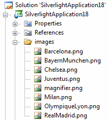

# Bind to Objects

Since RadCoverFlow is an ItemsControl, it can easily be bound to any collection of items. In this section we will bind RadCoverFlow to an ObservableCollection of type string. Each item in this collection will contain the path to a particular image. The end result should be similar to the one bellow.

 
Before we begin, let’s make sure that we have added the image files to our project. I have placed them in an images folder.

Once we have the images in the project, let’s create the ObservableCollection containing them.

#### __C#__

{{region coverflow-databinding-overview_0}}
	ObservableCollection<string> championsLeagueTeams = new ObservableCollection<string>();
	championsLeagueTeams.Add("images/Barcelona.png");
	championsLeagueTeams.Add("images/BayernMunchen.png");
	championsLeagueTeams.Add("images/Chelsea.png");
	championsLeagueTeams.Add("images/Juventus.png");
	championsLeagueTeams.Add("images/Milan.png");
	championsLeagueTeams.Add("images/OlympiqueLyon.png");
	championsLeagueTeams.Add("images/RealMadrid.png");
{{endregion}}

Next in the agenda is to add RadCoverFlow to our page.

#### __XAML__

{{region coverflow-databinding-overview_1}}
	<telerik:RadCoverFlow ItemsSource="{Binding}">
		<telerik:RadCoverFlow.ItemTemplate>
			<DataTemplate>
				<Image Source="{Binding}" Width="225" Height="225" Stretch="Uniform" telerik:RadCoverFlow.EnableLoadNotification="True" />
			</DataTemplate>
		</telerik:RadCoverFlow.ItemTemplate>
	</telerik:RadCoverFlow>
{{endregion}}

Pay attention to the ItemsSource="{Binding}" line. This means that the collection we are going to bind to is passed as a data context. This means that we have to do one last thing. Right after the last team is added, add the line bellow.

this.DataContext = championsLeagueTeams;
