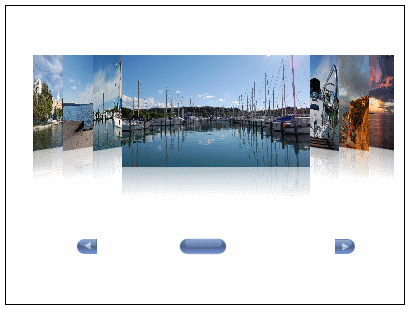

# Create your own navigation

This article explains in details how to create your own navigation using a range control, e.g. one that inherits from the RangeBase class.

The first thing we need to do is to declare a CoverFlow control with some items in a straight-forward manner.

#### __XAML__

{{region xaml-coverflow-navigation_0}}
	<StackPanel x:Name="LayoutRoot">
	   <telerik:RadCoverFlow x:Name="cover" Height="600" >
			<telerik:RadCoverFlowItem Background="White"/>
			<telerik:RadCoverFlowItem Background="Red"/>
			<telerik:RadCoverFlowItem Background="Green"/>
			<telerik:RadCoverFlowItem Background="Yellow"/>
			<telerik:RadCoverFlowItem Background="Blue"/>
			<telerik:RadCoverFlowItem Background="Pink"/>
	   </telerik:RadCoverFlow>
	</StackPanel>
{{endregion}}

To make things simpler you can either implement your own range control or choose among a ScrollBar, a RadNumericUpdown or a RadSlider. Using element binding you can easily associate the SelectedIndex of the CoverFlow to the value of your range control like this.

#### __XAML__

{{region xaml-coverflow-navigation_1}}
	<telerik:RadSlider Value="{Binding SelectedIndex, ElementName=cover, Mode=TwoWay}"/>
{{endregion}}

Now if you change the value of the slider control, the binding will also change the SelectedIndex of the CoverFlow control declared above. However, you also need to constraint the range from the Minimum possible index to the Maximum one. You can safely associate the Minimum value to zero, on the other hand the Maximum value needs some further consideration as your collections will vary in size. That is why, you need a binding that will always check the size of the collection and constraint the range control to it. The easiest way to do that is to create another binding that binds to the count of the items of your collection similar to this:

#### __XAML__

{{region xaml-coverflow-navigation_2}}
	<telerik:RadSlider Value="{Binding SelectedIndex, ElementName=cover, Mode=TwoWay}" Minimum="0" 
			Maximum="{Binding Items.Count, ElementName=cover}"/>
{{endregion}}

Note that if you use ItemsSource for binding you should substitute the Items.Count Path to ItemsSource.Count. However, property Count is not zero based value like the index array. Due to that, we will have an extra element available in our range. Unfortunately, there is no way you can tell the expression binding tto evaluate an expression that binds the property less a certain number, e.g. Items.Count -1. However, you can create a simple ValueConverter that can do the heavy lifting for you. Here is a simple int to int value converter that just sums the value and the converter parameter.

#### __C#__

{{region cs-coverflow-navigation_3}}
	public class IntToIntValueConverter : IValueConverter
	{
		object IValueConverter.Convert(object value, Type targetType, object parameter, System.Globalization.CultureInfo culture)
		{
			int val;
			int param;
			if ((int.TryParse(value.ToString(), out val) && (int.TryParse(parameter.ToString(), out param))))
			{
				 return val + param;
			}
			return value;
		}

		object IValueConverter.ConvertBack(object value, Type targetType, object parameter, System.Globalization.CultureInfo culture)
		{
			if (value is int && parameter is int)
			{
				 return (int)value + (int)parameter;
			}
			return DependencyProperty.UnsetValue;
		}
	}
{{endregion}}

You can easily declare the value converter source part of the page and associate it with the Converter property of the Binding Expression. You also need to provide the converter parameter, in our case, -1. You final version should look similar to this:

#### __XAML__

{{region xaml-coverflow-navigation_4}}
	<UserControl.Resources>
	       <local:IntToIntValueConverter x:Key="IntToIntValueConverter"/>
	</UserControl.Resources>
	<StackPanel x:Name="LayoutRoot">
	       <telerik:RadCoverFlow x:Name="cover" Height="600">
	              <telerik:RadCoverFlowItem Background="White"/>
	              <telerik:RadCoverFlowItem Background="Red"/>
	              <telerik:RadCoverFlowItem Background="Green"/>
	              <telerik:RadCoverFlowItem Background="Yellow"/>
	              <telerik:RadCoverFlowItem Background="Blue"/>
	              <telerik:RadCoverFlowItem Background="Pink"/>
	       </telerik:RadCoverFlow>
	       <telerik:RadSlider Value="{Binding SelectedIndex, ElementName=cover, Mode=TwoWay}" Minimum="0" 
			Maximum="{Binding Items.Count, ElementName=cover, Converter={StaticResource IntToIntValueConverter}, ConverterParameter=-1}"/>
	</StackPanel>
{{endregion}}

Note that all properties used in this example are inherited from the RangeBase control, thus you can easily change name of the control and set some control-specific properties to have navigation based on RadNumericUpDown or ScrollBar like this:

#### __XAML__

{{region xaml-coverflow-navigation_5}}
	<ScrollBar Orientation="Horizontal" Value="{Binding SelectedIndex, ElementName=cover, Mode=TwoWay}" Minimum="0" 
			Maximum="{Binding Items.Count, ElementName=cover, Converter={StaticResource IntToIntValueConverter}, ConverterParameter=-1}"/>
{{endregion}}

Or

#### __XAML__

{{region xaml-coverflow-navigation_6}}
	<telerik:RadNumericUpDown ShowTextBox="False" Value="{Binding SelectedIndex, ElementName=cover, Mode=TwoWay}" Minimum="0" 
			Maximum="{Binding Items.Count, ElementName=cover, Converter={StaticResource IntToIntValueConverter}, ConverterParameter=-1}"/>
{{endregion}}

