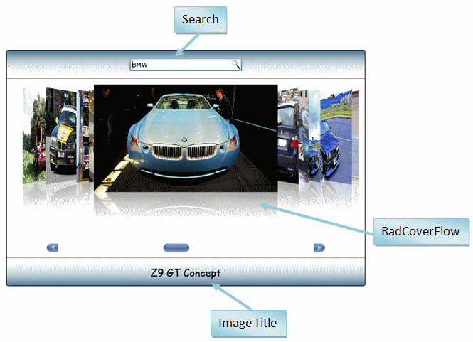

# Bind to XML

This section will explain how to bind RadCoverFlow to an XML data. In particular we will create an application that will call a Flickr web-service and based on what is specified in the search text box a result will be returned. 

There are many approaches to achieve the result above. For this particular section I have chosen to pass an observable collection as a data context to the RadCoverFlow control.

#### __C#__

{{region cs-coverflow-xml-databanding_0}}
	private ObservableCollection<ImageInfo> imagesCollection = new ObservableCollection<ImageInfo>();
	public Default_Cs()
	{
	    InitializeComponent();
	    this.coverFlow.DataContext = imagesCollection;
	    //So how do we actually fill the imagesCollection? It is done using the WebClient entity.Basically we call the DownloadStringAsync method of a WebClient instance and as soon as the result arrives, we handle it in the DownloadStringCompleted event handler.
	    WebClient webClient = new WebClient();
	    webClient.DownloadStringCompleted += new DownloadStringCompletedEventHandler(this.webClient_DownloadStringCompleted);
	    // search string is composed by combining http://api.flickr.com/services/feeds/photos_public.gne?tags=
	    // and the value in the search textbox
	    webClient.DownloadStringAsync(new Uri("searchUri", UriKind.Absolute));
	}
	//As you can see, the imagesCollection is filled with ImageInfo objects.The ImageInfo represents an image from Flickr.It has 2 properties –ImageTitle and ImageUrl, both of them string.This is how the ImageInfo class looks like this:
	public class ImageInfo : INotifyPropertyChanged
	{
	    public event PropertyChangedEventHandler PropertyChanged;
	    private string imageTitle, imageUrl;
	    public string ImageTitle
	    {
	        get { return this.imageTitle; }
	        set
	        {
	            if (value != this.imageTitle)
	            {
	                this.imageTitle = value;
	                this.FirePropertyChanged("ImageTitle");
	            }
	        }
	    }
	    public string ImageUrl
	    {
	        get { return this.imageUrl; }
	        set
	        {
	            if (value != this.imageUrl)
	            {
	                this.imageUrl = value;
	                this.FirePropertyChanged("ImageUrl");
	            }
	        }
	    }
	    private void FirePropertyChanged(string propertyName)
	    {
	        if (this.PropertyChanged != null)
	        {
	            this.PropertyChanged(this, new PropertyChangedEventArgs(propertyName));
	        }
	    }
	}
	private void webClient_DownloadStringCompleted(object sender, DownloadStringCompletedEventArgs e)
	{
	    // remove any images from previous searches
	    this.imagesCollection.Clear();
	    XDocument feed = XDocument.Parse(e.Result);
	    // 10 images should be enough for demonstrative purposes
	    int numberOfPictures = 10;
	    // Code bellow might vary when calling different services. The one bellow parses the result
	    // returned by a Flickr service
	    foreach (XElement entry in feed.Root.Elements(XName.Get("entry", "http://www.w3.org/2005/Atom")))
	    {
	        string[] links = (from link in entry.Elements(XName.Get("link", "http://www.w3.org/2005/Atom"))
	                          where string.Compare(link.Attribute(XName.Get("rel")).Value, "enclosure") == 0
	                          select link.Attribute(XName.Get("href")).Value).ToArray<string>();
	        if (links.Length > 0)
	        {
	            // Add a new instance of the ImageInfo class
	            imagesCollection.Add(new ImageInfo()
	            {
	                ImageTitle = entry.Element(XName.Get("title", "http://www.w3.org/2005/Atom")).Value,
	                ImageUrl = links[0]
	            });
	            // Decrement exit if 10 images are already created
	            numberOfPictures -= 1;
	            if (numberOfPictures == 0)
	            {
	                break;
	            }
	        }
	    }
	}
{{endregion}}

Then you should create your RadCoverFlow as follows:

#### __XAML__

{{region xaml-coverflow-xml-databanding_1}}
    <telerik:RadCoverFlow x:Name="coverFlow" ItemsSource="{Binding}">
      <telerik:RadCoverFlow.ItemTemplate>
        <DataTemplate>
          <Image Source="{Binding ImageUrl}" Width="300" Height="225" Stretch="Uniform" telerik:RadCoverFlow.EnableLoadNotification="True" />
        </DataTemplate>
      </telerik:RadCoverFlow.ItemTemplate>
    </telerik:RadCoverFlow>
{{endregion}}

 
