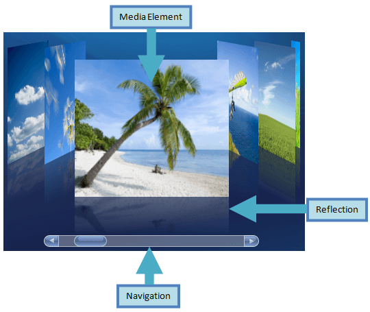

# Structure

This section defines terms and concepts used in the scope of __RadCoverFlow__ you have to get familiar with prior to continue reading this help. They can also be helpful when contacting our support service in order to describe your issue better. For more detailed descriptions of the required parts of the control please visit the Required Parts section.

* __MediaElement__ - Image element that is used to display images. 

* __Reflection__ - reflection of the Media Element 

* __Navigation__ - ScrollBar used to navigate throughout the collection of images.
