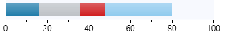
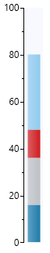

# Axis

RadDataBar provides an additional component that allows you display a data axis.

The __RadHorizontalDataAxis__ and __RadVerticalDataAxis__ are part of the data bar suite and allow you to display a stand alone axis control next to the data bar visualization. The axis size should be synced with the size of the data bar in order to correctly match the value range.

__Example 1: Using RadHorizontalDataAxis__
```XAML
	<Grid Width="300" Height="50">
		<Grid.RowDefinitions>
			<RowDefinition />
			<RowDefinition Height="Auto"/>
		</Grid.RowDefinitions>
		<telerik:RadStackedDataBar Background="#F7F9FE" />
		<telerik:RadHorizontalDataAxis Grid.Row="1" Step="10" />
	</Grid>
```

__Example 2: Setting the RadStackedDataBar ItemsSource__
```C#
	public MyUserControl()
	{
		InitializeComponent();
		this.stackedDataBar.ItemsSource = new List<double>() { -20, 16, 20, 12, 32 };
	}
```




__Example 3: Using RadVerticalDataAxis__
```XAML
	<Grid Width="50" Height="300">
        <Grid.ColumnDefinitions>
            <ColumnDefinition Width="Auto"/>
            <ColumnDefinition />
        </Grid.ColumnDefinitions>
        <telerik:RadVerticalDataAxis Step="10" />
        <telerik:RadStackedDataBar x:Name="stackedDataBar" Background="#F7F9FE" Grid.Column="1">
            <telerik:RadStackedDataBar.LayoutTransform>
                <RotateTransform Angle="-90" />
            </telerik:RadStackedDataBar.LayoutTransform>
        </telerik:RadStackedDataBar>
    </Grid>
```



The data axis control provides the following public properties that can be used in order __to modify its appearance__:

* __LabelStep__: Indicates that one out of `n` ticks should have a label where `n` is the value of the property.

* __MajorTickLength__: Controls the size of the major ticks.

* __Minimum and Maximum__: The start and end value for the axis.

* __MinorTickLength__: Controls the size of the minor ticks.

* __Step__: Indicates the step of the ticks. For instance, if the minumum is "-20" and the maximum is "10", and the step is "3" - ticks will be visualized to indicate -20, -17, -14 .. 4, 7, 10.

* __Stroke__: The stroke brush for the axis.

* __TicksDistance__: Specifies a value indicating that every axis tick should be placed at least `n` pixels away from the next one, where `n` is the value of the property. Use when you have too much data to display on the axis to control the number of ticks shown. 

	> The TickDistance property has a smaller priority than Step. If both Step and TickDistance are set - the axis algorithm that distributes the ticks will only take into consideration the Step property. These two properties should not be used in conjunction.

## See Also  
* [Properties]()
* [Data Binding]()

