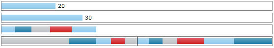

# DataBinding

Databinding for the RadDataBar control involves the correlation between the business logic/data, and the visualization of the control.

This article describes how to data bind the different RadDataBar controls.

## RadDataBar

The RadDataBar control allows you to data bind its __Value__ property, which can be used to connect the UI with the model. The Value determines that size of the bar according to the Minimum and Maximum values of the RadDataBar control. 

The bar size will automatically update if the data bound property in the model changes. To ensure that this works properly, the underlying data context must implement the [INotifyPropertyChanged](http://msdn.microsoft.com/en-us/library/system.componentmodel.inotifypropertychanged(VS.95).aspx%20) interface.

Find a runnable sample in the [Code Example](#code-example) section of this article.

## RadStackedDataBar and RadStacked100DataBar

RadStackedDataBar and RadStacked100DataBar allow you to data bind their __ItemsSource__ property to any [IEnumerable](http://msdn.microsoft.com/en-us/library/system.collections.ienumerable.aspx). For each item in the ItemsSource a bar in the stack will be generated. 

In case the ItemsSource is bound to a collection of numbers (like the `double` or `int` primitives), the data bars will be generated automatically. If the ItemsSource is bound to a collection of any other custom object type, you will need to provide the name of the property that should be used to access the data bar values. To do so, set the __ValuePath__ property of the data bar control. For example, if the collection contains items of type `MyItemInfo` which have a property named `MyValue`, the ValuePath property should hold the "MyValue" string.  

The stacked data bar controls also provide full support for change notifications - data sources that implement the [INotifyCollectionChanged](http://msdn.microsoft.com/en-us/library/system.collections.specialized.inotifycollectionchanged.aspx), and underlying data items that implement [INotifyPropertyChanged](http://msdn.microsoft.com/en-us/library/system.componentmodel.inotifypropertychanged(VS.95).aspx%20) are properly tracked and automatically reflected by the UI.

Find a runnable sample in the [Code Example](#code-example) section of this article.

## Code Example

This example shows how to data bind the RadDataBar controls to a view model.

__Example 1: Creating a sample model containing information about the data bars__  
<snippet id='raddatabar-databinding-example_1_creating_a_sample_model_containing_information_about_the_data_bars-cs' />

<snippet id='raddatabar-databinding-example_1_creating_a_sample_model_containing_information_about_the_data_bars-vb' />

__Example 2: Setting up the model__  
<snippet id='raddatabar-databinding-example_2_setting_up_the_model-cs' />

<snippet id='raddatabar-databinding-example_2_setting_up_the_model-vb' />

__Example 3: Define the RadDataBars components__  
<snippet id='raddatabar-databinding-example_3_define_the_raddatabars_components-xaml' />

#### __Figure 1: The different data bars__

## See Also  
* [Getting Started]()
* [Properties]()
