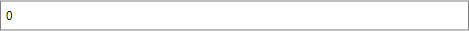

# Getting Started

This tutorial will walk you through the required steps for using __RadDataBar__. 

* [Assembly References](#assembly-references)
* [Adding RadDataBar to the Project](#adding-raddatabar-to-the-project)
* [Displaying collection of Bars](#displaying-collection-of-bars)

## Assembly References

In order to add __RadDataBar__ in your application, you need to add references to the following assemblies:

* __Telerik.Windows.Controls__
* __Telerik.Windows.Controls.DataVisualization__
* __Telerik.Windows.Data__

## Visualization Types

The RadDataBar suite contains the following controls representing the different visualizations.

* __RadDataBar__: Displays a single data bar representing a value. It is useful for comparing quantitative values of data. You can easily highlight negative values.   

    

* __RadStackedDataBar__: Displays a set of stacked bars where each bar represents a value. The size of each bar is calculated in accordance to the set Minimum and Maximum properties.   

    

* __RadStacked100DataBar__: Displays a set of stacked bars where each value represents a percentage of the value. The percent is calculated based on the bar's value and the sum of all values in the stack.  

    

## Adding RadDataBar to the Project

#### __[XAML] Example 1: Defining RadDataBar Declaratively__
{{region raddatabar-gettingstarted_0}}
	     <telerik:RadDataBar Height="30" 
                            BorderBrush="Gray"
							BorderThickness="1"/>
{{endregion}}

#### __Figure 1: Adding RadDataBar__

By default the __Value__ property of the control will have a value of __0__. It can be bound to a property of the business model so the required data is displayed. This is covered in details in the [Data Binding]() topic.

## Displaying collection of Bars

__RadDataBar__ is intended to display a single value. When you need to display a collection of values, you can use the __RadStackedDataBar__ and __RadStacked100DataBar__ controls. They will both generate a bar for each value present in its __ItemsSource__. 

The difference between the controls is how the sizes of the bars are calculated. The size of each bar in the **RadStackedDataBar** is calculated in accordance to the set **Minimum** and **Maximum**. On the other hand, each bar's size in the **RadStacked100DataBar** corresponds to the percent of the bar's value compared to the sum of all values in the stack.

More information can be found in the [Data Binding]() article.

## See Also

* [Properties]()
* [Data Binding]()

