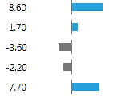
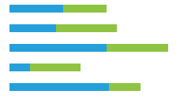
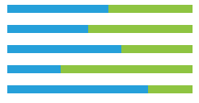
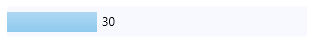
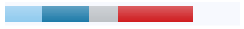
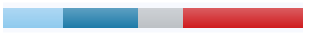

# Getting Started with {{ site.framework_name }} DataBar

This tutorial will walk you through the required steps for using __RadDataBar__. 

* [Adding Telerik Assemblies Using NuGet](#adding-telerik-assemblies-using-nuget)
* [Adding Assembly References Manually](#adding-assembly-references-manually)
* [Adding RadDataBar to the Project](#adding-raddatabar-to-the-project)
* [Displaying collection of Bars](#displaying-collection-of-bars)

## Adding Telerik Assemblies Using NuGet

To use __RadDataBar__ when working with NuGet packages, install the `Telerik.Windows.Controls.DataVisualization.for.Wpf.Xaml` package. The [package name may vary]() slightly based on the Telerik dlls set - [Xaml or NoXaml]()

Read more about NuGet installation in the [Installing UI for WPF from NuGet Package]() article.

>tip With the 2025 Q1 release, the Telerik UI for WPF has a new licensing mechanism. You can learn more about it [here]().

## Adding Assembly References Manually

If you are not using NuGet packages, you can add a reference to the following assemblies:

* __Telerik.Licensing.Runtime__
* __Telerik.Windows.Controls__
* __Telerik.Windows.Controls.DataVisualization__
* __Telerik.Windows.Data__

## Visualization Types

The RadDataBar suite contains the following controls representing the different visualizations.

* __RadDataBar__: Displays a single data bar representing a value. It is useful for comparing quantitative values of data. You can easily highlight negative values.   

    

* __RadStackedDataBar__: Displays a set of stacked bars where each bar represents a value. The size of each bar is calculated in accordance to the set Minimum and Maximum properties.   

    

* __RadStacked100DataBar__: Displays a set of stacked bars where each value represents a percentage of the value. The percent is calculated based on the bar's value and the sum of all values in the stack.  

    

## Using RadDataBar

To display a data bar visualization, you can just add a RadDataBar control in the view and set its __Value__ property. This will create a horizontal bar measured according to the Value. The value range of the bar is defined by its __Minimum__ and __Maximum__ properties, which default values are 0 an 100 respectively.

#### __[XAML] Example 1: Defining RadDataBar__
{{region raddatabar-getting-started-0}}
	<telerik:RadDataBar Value="30" Width="300" Height="30" Background="#F7F9FE" />
{{endregion}}

## Using RadStackedDataBar and RadStacked100DataBar

To display a stacked data bar visualization, you can add a __RadStackedDataBar__ control in the view and set its __ItemsSource__ property. This will create a set of stacked horizontal bars measured according to the values in the ItemsSource. The value range of the bar is defined by its __Minimum__ and __Maximum__ properties, which default values are 0 an 100 respectively.

#### __[XAML] Example 2: Defining RadStackedDataBar__
{{region raddatabar-getting-started-1}}
	<telerik:RadStackedDataBar x:Name="stackedDataBar" Height="30" Width="300" Background="#F7F9FE"/>
{{endregion}}

#### __[C#] Example 3: Setting RadStackedDataBar ItemsSource__
{{region raddatabar-getting-started-2}}
	public MyUserControl()
	{
		InitializeComponent();
		this.stackedDataBar.ItemsSource = new List<double>() { 16, 20, 12, 32 };
	}
{{endregion}}

The __RadStacked100DataBar__ works very similar to the RadStackedDataBar, but instead of using absolute values and relying on the predefined minimum and maximum values, it displays the bars as a percetange of the whole stack. For example, the sum of the values from __Example 3__ is `16 + 20 + 12 + 32 = 80` which will be the range's maximum. Then each value in the ItemsSource is turned to a value relative to the range and based on this information its bar's width is calculated. For example, 20 will be 0.25 which is 25% of the 80's range. This means that the bar for the value 20 will take 25% of the whole data bar.

To define RadStacked100DataBar, use Example 2 and 3, but replace the RadStackedDataBar with RadStacked100DataBar.

#### __[XAML] Example 4: Defining RadStacked100DataBar__
{{region raddatabar-getting-started-3}}
	<telerik:RadStacked100DataBar x:Name="stackedDataBar" Height="30" Width="300" Background="#F7F9FE"/>
{{endregion}}


## Telerik UI for WPF Learning Resources

* [Telerik UI for WPF DataBar Component](https://www.telerik.com/products/wpf/databars.aspx)
* [Getting Started with Telerik UI for WPF Components]()
* [Telerik UI for WPF Installation]()
* [Telerik UI for WPF and WinForms Integration]()
* [Telerik UI for WPF Visual Studio Templates]()
* [Setting a Theme with Telerik UI for WPF]()
* [Telerik UI for WPF Virtual Classroom (Training Courses for Registered Users)](https://learn.telerik.com/learn/course/external/view/elearning/16/telerik-ui-for-wpf) 
* [Telerik UI for WPF License Agreement](https://www.telerik.com/purchase/license-agreement/wpf-dlw-s)


## See Also

* [Properties]()
* [Data Binding]()

