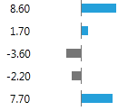
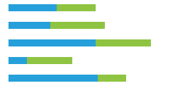
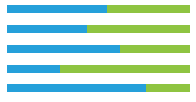
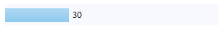
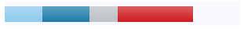
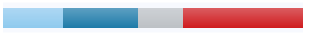

# Getting Started

This tutorial will walk you through the required steps for using __RadDataBar__. 

## Assembly References

In order to add __RadDataBar__ in your application, you need to add references to the following assemblies:

* __Telerik.Windows.Controls__
* __Telerik.Windows.Controls.DataVisualization__
* __Telerik.Windows.Data__

## Visualization Types

The RadDataBar suite contains the following controls representing the different visualizations.

* __RadDataBar__: Displays a single data bar representing a value. It is useful for comparing quantitative values of data. You can easily highlight negative values.   

    

* __RadStackedDataBar__: Displays a set of stacked bars where each bar represents a value. The size of each bar is calculated in accordance to the set Minimum and Maximum properties.   

    

* __RadStacked100DataBar__: Displays a set of stacked bars where each value represents a percentage of the value. The percent is calculated based on the bar's value and the sum of all values in the stack.  

    

## Using RadDataBar

To display a data bar visualization, you can just add a RadDataBar control in the view and set its __Value__ property. This will create a horizontal bar measured according to the Value. The value range of the bar is defined by its __Minimum__ and __Maximum__ properties, which default values are 0 an 100 respectively.

#### __[XAML] Example 1: Defining RadDataBar__
{{region raddatabar-getting-started-0}}
	<telerik:RadDataBar Value="30" Width="300" Height="30" Background="#F7F9FE" />
{{endregion}}

## Using RadStackedDataBar and RadStacked100DataBar

To display a stacked data bar visualization, you can add a __RadStackedDataBar__ control in the view and set its __ItemsSource__ property. This will create a set of stacked horizontal bars measured according to the values in the ItemsSource. The value range of the bar is defined by its __Minimum__ and __Maximum__ properties, which default values are 0 an 100 respectively.

#### __[XAML] Example 2: Defining RadStackedDataBar__
{{region raddatabar-getting-started-1}}
	<telerik:RadStackedDataBar x:Name="stackedDataBar" Height="30" Width="300" Background="#F7F9FE"/>
{{endregion}}

#### __[C#] Example 3: Setting RadStackedDataBar ItemsSource__
{{region raddatabar-getting-started-2}}
	public MyUserControl()
	{
		InitializeComponent();
		this.stackedDataBar.ItemsSource = new List<double>() { 16, 20, 12, 32 };
	}
{{endregion}}

The __RadStacked100DataBar__ works very similar to the RadStackedDataBar, but instead of using absolute values and relying on the predefined minimum and maximum values, it displays the bars as a percetange of the whole stack. For example, the sum of the values from __Example 3__ is `16 + 20 + 12 + 32 = 80` which will be the range's maximum. Then each value in the ItemsSource is turned to a value relative to the range and based on this information its bar's width is calculated. For example, 20 will be 0.25 which is 25% of the 80's range. This means that the bar for the value 20 will take 25% of the whole data bar.

To define RadStacked100DataBar, use Example 2 and 3, but replace the RadStackedDataBar with RadStacked100DataBar.

#### __[XAML] Example 4: Defining RadStacked100DataBar__
{{region raddatabar-getting-started-3}}
	<telerik:RadStacked100DataBar x:Name="stackedDataBar" Height="30" Width="300" Background="#F7F9FE"/>
{{endregion}}

## Setting a Theme

The controls from our suite support different themes. You can see how to apply a theme different than the default one in the [Setting a Theme]() help article.

>important Changing the theme using implicit styles will affect all controls that have styles defined in the merged resource dictionaries. This is applicable only for the controls in the scope in which the resources are merged. 

To change the theme, you can follow the steps below:

* Choose between the themes and add reference to the corresponding theme assembly (ex: **Telerik.Windows.Themes.Windows8.dll**). You can see the different themes applied in the **Theming** examples from our [WPF Controls Examples](https://demos.telerik.com/wpf/)[Silverlight Controls Examples](https://demos.telerik.com/silverlight/#DataBar/Theming) application.

* Merge the ResourceDictionaries with the namespace required for the controls that you are using from the theme assembly. For the __RadDataBar__, you will need to merge the following resources:

	* __Telerik.Windows.Controls.DataVisualization__

__Example 2__ demonstrates how to merge the ResourceDictionaries so that they are applied globally for the entire application.

#### __[XAML] Example 2: Merge the ResourceDictionaries__  
{{region xaml-raddatabar-gettingstarted_2}}
	<Application.Resources>
		<ResourceDictionary>
			<ResourceDictionary.MergedDictionaries>
				<ResourceDictionary Source="/Telerik.Windows.Themes.Windows8;component/Themes/System.Windows.xaml"/>
				<ResourceDictionary Source="/Telerik.Windows.Themes.Windows8;component/Themes/Telerik.Windows.Controls.DataVisualization.xaml"/>
			</ResourceDictionary.MergedDictionaries>
		</ResourceDictionary>
	</Application.Resources>
{{endregion}}

>Alternatively, you can use the theme of the control via the [StyleManager](https://docs.telerik.com/devtools/wpf/styling-and-appearance/stylemanager/common-styling-apperance-setting-theme-wpf)[StyleManager](https://docs.telerik.com/devtools/silverlight/styling-and-appearance/stylemanager/common-styling-apperance-setting-theme).

__Figure 2__ shows a __RadDataBar__ with the **Windows8** theme applied.
	
#### __Figure 2: RadDataBar with the Windows8 theme__

## See Also

* [Properties]()
* [Data Binding]()

