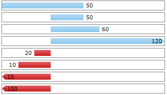

# Properties

This topic aims to get you familiar with the specific properties of each data bar type.

## DataBinding

* __Value (a property of RadDataBar)__ - expects a value which will be used to determine the size of the bar.

* __ValuePath (a property of RadStackedDataBar and RadStacked100DataBar)__ - expects the name of the property from the underlying data item, which will determine the value of each bar in the stack.

## RadDataBar

* __BarHeightPercent__ - specifies the height in percent for the bar to be displayed. For example a value of 0.5 will mean that the Bar will take 50% of the available space and there will be 25% available space on top and 25% on bottom.

* __LabelPosition__ - It's an enum with several options that you may choose from: Left, Right, EndOfBarInside or EndOfBarOutside. If LabelPosition is set to EndOfBarOutside/EndOfBarInside - the LabelDistance is the maximum distance in pixels between the bar and the textblock. If LabelPosition is set to Left/Right - LabelDistance is the margin of the text block.          

* __LabelFormat__ - used to specify a label format expression [custom numeric format string](http://msdn.microsoft.com/en-us/library/0c899ak8.aspx) to customize the labels.

* __AxisVisibility__ - controls the visibility of the axis that marks the position origin value.

* __AxisStroke__ - sets stroke for the axis

* __LabelVisibility__ - controls whether the label should appear or not.

* __LabelStyle__ - for customization of the databar labels.

* __BorderBrush__ - provides a Brush to customize the border of the databar. Note that you'll also need to specify a *BorderThickness*.

* __ValueBrush and NegativeValueBrush__ - provides a Brush to customize the appearance of the positive and negative bars respectively.

* __ValueBorderBrush and NegativeValueBorderBrush__ - provides a Brush to customize the border of the positive and negative bars respectively.

* __ShowOutOfRangeIndicators__ - boolean property that controls the visibility of the out-of-range indicators. By default it's value is true. You can read more about it in our Overflow and UnderOverflow templates topic.

* __OriginValue__ - defines an origin for the databar to start at. For example:           

	__Example 1: RadDataBar properties__

	```XAML
		 <telerik:RadDataBar Height="20" Value="50" BorderBrush="Gray" BorderThickness="1" Margin="2" />
		 <telerik:RadDataBar Height="20" Value="50" OriginValue="30" BorderBrush="Gray" BorderThickness="1" Margin="2" />
		 <telerik:RadDataBar Height="20" Value="60" OriginValue="30" BorderBrush="Gray" BorderThickness="1" Margin="2" />
		 <telerik:RadDataBar Height="20" Value="120" OriginValue="30" BorderBrush="Gray" BorderThickness="1" Margin="2" />
		 <telerik:RadDataBar Height="20" Value="20" OriginValue="30" BorderBrush="Gray" BorderThickness="1" Margin="2" />
		 <telerik:RadDataBar Height="20" Value="10" OriginValue="30" BorderBrush="Gray" BorderThickness="1" Margin="2" />
		 <telerik:RadDataBar Height="20" Value="-10" OriginValue="30" BorderBrush="Gray" BorderThickness="1" Margin="2" />
		 <telerik:RadDataBar Height="20" Value="-100" OriginValue="30" BorderBrush="Gray" BorderThickness="1" Margin="2" />
	```

	

## RadStackedDataBar and RadStacked100DataBar

* __BarBrushes__ - a Brush collection that is to be used with the bars.          

	The *BrushCollection* class is currently located in the Telerik.Windows.Controls.DataBars namespace so please mind adding a reference to it like so: "xmlns:dataBars="clr-namespace:Telerik.Windows.Controls.DataBars;assembly=Telerik.Windows.Controls.DataVisualization". Here's an example:

	__Example 2: RadStacked100DataBar BarBrushes property__

	```XAML
		 <telerik:RadStacked100DataBar.BarBrushes>
			<dataBars:BrushCollection>
				<SolidColorBrush Color="Red" />
				<SolidColorBrush Color="Green" />
				<SolidColorBrush Color="Blue" />
			</dataBars:BrushCollection>
		 </telerik:RadStacked100DataBar.BarBrushes>
	```

* __BarBorderBrushes__ - a Border Brush collection that is to be used with the bars.

* __ShowToolTips__ - controls the visibility of the tooltips.

* __ToolTipFormat__ - used to specify a format expression[ custom numeric format string](http://msdn.microsoft.com/en-us/library/0c899ak8.aspx) to customize the tooltips.

* __AxisVisibility__ - controls the visibility of the axis that will appear at the start of the first bar

* __AxisStroke__ - sets stroke for the axis

* __ToolTipPath__ - sets the name of the property from the underlying data item, which will determine what to be displayed with the tooltip.

* __ValuePath__ - sets the name of the property from the underlying data item, which will determine what the value of the bar is.

* __ValueBrush and NegativeValueBrush__ - provides a Brush to customize the appearance of the positive and negative bars respectively.

* __ValueBorderBrush and NegativeValueBorderBrush__ - provides a Brush to customize the border of the positive and negative bars respectively.

## RadHorizontalAxis

* __LabelStep__ - indicates that one out of n ticks should have a label where n is the value of the property.

* __MajorTickLength__ - controls the size of the major ticks.

* __Minimum and Maximum__ - the start and end value for the axis.

* __MinorTickLength__ - controls the size of the minor ticks.

* __Step__ - indicates the step of the ticks. For instance - if the minumum is "-20" and the maximum is "10" and the step is "3" - ticks will be visualized to indicate -20, -17, -14 .. 4, 7, 10.

* __Stroke__ - the stroke brush for the Axis

* __TicksDistance__ - specifies a value indicating that every axis tick should be placed at least n pixels away from the next one, where n is the value of the property. Use when you have too much data to display on the axis to control the number of ticks shown. 

	>The TickDitance property has a smaller priority than Step. If both Step and TickDistance are set - the axis algorithm that distributes the ticks will only take into consideration the Step property. These two properties should not be used in conjunction.

## See Also

* [Getting Started]()
* [Data Binding]()