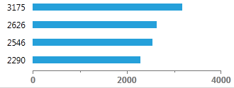

# Overview








Thank you for choosing __RadDataBar__!

The __RadDataBar__ control is an information graphic, which is characterized by small size, excellent performance and lightweight. By definition, the RadDataBar is designed to visually represent numeric values. Unlike RadSparkLine its main power is to compare the data cell-by-cell when integrated in grid.

>The following references are required in order to use the control:             
>	- Telerik.Windows.Controls.DataVisualization.dll
>	- Telerik.Windows.Data.dll
>	- Telerik.Windows.Controls.dll

The __Data Bar__ is actually a set of controls:

1. __RadDataBar__ - useful for comparing quantitative values of data. You can easily highlight negative values. 
    

2. __RadStackedDataBar__ - each bar represents a value. The size of each bar is calculated in accordance to the set Minimum and Maximum. 
    

3. __RadStacked100DataBar__ - this control will visualize stacked bars, where each bar's size corresponds to a percent. This percent is calculated based on the bar's value and the sum of all values in the stack. 
    

4. __RadHorizontalAxis__ - makes the comparison of data easier as it displays the dimensions of the data.
    
