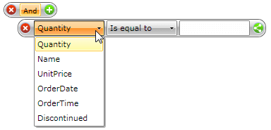
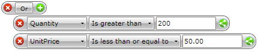
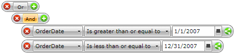
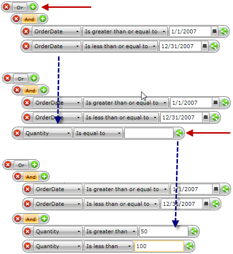

# End User Manual

__RadDataFilter__ allows you to create complex filter criteria within unlimited number of filter conditions combined by logical operators.  

The following article will show you how to:

* [Build simple filter criteria](#Build_Simple_Filter_Criteria)

* [Build complex filter criteria](#Build_Complex_Filter_Criteria)

## Build Simple Filter Criteria

To create a filter condition you need to define the column/field, the operator (__AND__ or __OR__) and the __Value__. For instance, __'Quantity > 200__' is a simple filter condition, where the __Quantity__ is a column/field name, __'>'__ is the "greater than" operator and __'200'__ is the value. Here is how to create this condition using the __RadDataFilter__ user interface.

If no filtering has been applied, __RadDataFilter__ will contain the root operator only.

 

To add your first filter criteria - click on the green plus sign on the right side. It will create a new row with several elements.

 

The first DropDown contains all the data fields/columns of the data source, to which __RadDataFilter__ is bound. They are automatically populated, so you do not need to do any code to get them. The second dropdown shows the available logical operators that could be applied against the type of the selected field. For example the text field will have the __Contains__ or __Starts With__ operators, while the __DateTime__ field will have __Is Greater Than__ operators.

Now that we have the field and the operator we need to provide the value. Just type __200__ in the __TextBox__ and hit enter. __RadDataFilter__ will query the data source and fill its __FilteredSource__ property with all data that satisfies the __'Quantity > 200'__ filter criteria. You can show the end result to any [ItemsSource control](). To further complicate the query, let's assume that we want to show the orders, which __Quantity is greater than 200 OR the UnitPrice is less than or equal to 50__.

To do so, just click on the __And__ root operator to switch it to __Or__ and then press the green plus sign to add another filter row.

 

## Build Complex Filter Criteria

By using __RadDataFilter__, you can easily build filter criteria which contains multiple logical (__Boolean__) operators combining simple filter conditions. First, you need to identify groups of filter conditions. A filter group is a set of simple filter conditions or other groups combined by the same logical operator. You can think of groups as clauses in a filter expression wrapped by round brackets. Let's take a look at the following sample filter criteria:

*__'OrderDate >= 1-Jan-2007 AND OrderDate <= 31-Dec-2007 OR Quantity > 50 AND Quantity < 100'__*

In this expression, we'll identify groups by wrapping them with round brackets as follows:

*__'(OrderDate >= 1-Jan-2007 AND OrderDate <= 31-Dec-2007) OR (Quantity > 50 AND Quantity < 100)'__*

There are two groups of filter conditions in the example above. Within each group, filter conditions are combined by the same logical operator:

__Group 1__: *OrderDate >= 1-Jan-2007 AND OrderDate <= 31-Dec-2007*

__Group 2__*: Quantity > 50 AND Quantity < 100*

The groups are combined by the same OR operator. After the filter groups have been identified, the filter expression can be easily built using __RadDataFilter.__

Change the root logical operator to OR. To do this, click the current AND operator and it will switch to OR.

Add a new filter condition group by clicking the green plus sign. This will create a new filtering row. To create a group - click on its button. 

Now change the field column from __Quantity__ to __OrderDate__ and the filter operator from *Is equal to* to *Is greater than or equal to* and select the proper date from the built-in calendar.

 

Now the first group is done, let's create the second one. Click on the green plus sign next to the OR operator to create the next group. Follow step 2 from above to add two conditions to the group.

 

That's it. The following filter criteria has been applied to the __RadDataFilter__:

*__'(OrderDate >= 1-Jan-2007 AND OrderDate <= 31-Dec-2007) OR (Quantity > 50 AND Quantity < 100)'__*

# See Also

 * [Overview]()

 * [Getting Started]()

 * [Visual Structure]()
