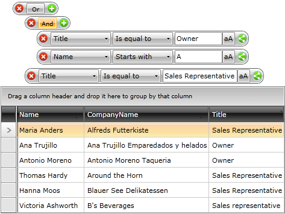

# Getting Started with {{ site.framework_name }} DataFilter

__RadDataFilter__ is a control that allows you to filter your data. It allows you to create complex filter criteria within unlimited number of filter conditions combined by logical operators. You can easily add nested filter criteria by clicking on the button for adding nested operators. This topic will help you to quickly get started using this control. It will focus on the following:

* [Adding RadDataFilter](#adding-raddatafilter)

* [Configuring the RadDataFilter](#configuring-the-raddatafilter)

* [Filtering a Collection](#filtering-a-collection)

* [Filtering a RadGridView](#filter-radgridview)

* [Exposing the Filtered Collection](#exposing-the-filtered-collection)

## Adding Telerik Assemblies Using NuGet

To use __RadDataFilter__ when working with NuGet packages, install the `Telerik.Windows.Controls.Data.for.Wpf.Xaml` package. The [package name may vary]() slightly based on the Telerik dlls set - [Xaml or NoXaml]()

Read more about NuGet installation in the [Installing UI for WPF from NuGet Package]() article.

>tip With the 2025 Q1 release, the Telerik UI for WPF has a new licensing mechanism. You can learn more about it [here]().

## Adding Assembly References Manually

If you are not using NuGet packages, you can add a reference to the following assemblies:

* __Telerik.Licensing.Runtime__
* __Telerik.Windows.Controls__
* __Telerik.Windows.Controls.Data__
* __Telerik.Windows.Data__

You can find the required assemblies for each control from the suite in the [Controls Dependencies]()[Controls Dependencies]() help article.

## Adding RadDataFilter

To use the __RadDataFilter__ in the XAML you have to add the following namespace declaration:

#### __[XAML] Example 1: Namespace declaration__  
{{region xaml-datafilter-getting-started_0}}
	xmlns:telerik="http://schemas.telerik.com/2008/xaml/presentation"
{{endregion}}

#### __[XAML] Example 2: Creating RadDataFilter__  
{{region xaml-datafilter-getting-started_1}}
	<telerik:RadDataFilter x:Name="radDataFilter" />
{{endregion}}

## Configuring the RadDataFilter

You can configure __RadDataFilter__ via the properties that it exposes. You can do the following:

* Use __DataAnotations__ to mark the members of your business objects. [Read more]()

* Use the __RadDataFilter__ in __Unbound Mode__. [Read more]()

* Access the __FilterDescriptors__ collection. [Read more]()

## Filtering a Collection

> To learn more about the usage of the __Source__ and the __FilteredSource__ properties, read the [Source and Filtered Source]() article.

__RadDataFilter__ can filter any collection that implements the __IEnumerable__ interface. The only thing that you have to do is to pass the collection to its __Source__ property.

The collection in this example will hold business objects of type __Employee__. Here is the code for the __Employee__ class:

#### __[C#] Example 3: Defining the Employee class__  
{{region cs-datafilter-getting-started_2}}
	public class Employee
	{
	    public Employee( string name, string companyName, string title )
	    {
	        this.Name = name;
	        this.CompanyName = companyName;
	        this.Title = title;
	    }
	    public string Name
	    {
	        get;
	        set;
	    }
	    public string CompanyName
	    {
	        get;
	        set;
	    }
	    public string Title
	    {
	        get;
	        set;
	    }
	}
{{endregion}}

#### __[VB.NET] Example 3: Defining the Employee class__
{{region vb-datafilter-getting-started_3}}

	Public Class Employee
	 Public Sub New(name As String, companyName As String, title As String)
	  Me.Name = name
	  Me.CompanyName = companyName
	  Me.Title = title
	 End Sub
	 Public Property Name() As String
	  Get
	   Return m_Name
	  End Get
	  Set
	   m_Name = Value
	  End Set
	 End Property
	 Private m_Name As String
	 Public Property CompanyName() As String
	  Get
	   Return m_CompanyName
	  End Get
	  Set
	   m_CompanyName = Value
	  End Set
	 End Property
	 Private m_CompanyName As String
	 Public Property Title() As String
	  Get
	   Return m_Title
	  End Get
	  Set
	   m_Title = Value
	  End Set
	 End Property
	 Private m_Title As String
	End Class
{{endregion}}

#### __[XAML] Example 4: Creating RadDataFilter__ 
{{region xaml-datafilter-getting-started_4}}
	<telerik:RadDataFilter x:Name="radDataFilter" />
{{endregion}}

Prepare a simple collection of employees and pass it to the __Source__ property of the __RadDataFilter__.

#### __[C#] Example 5: Creating a collection of Employees__

{{region cs-datafilter-getting-started_5}}

	ObservableCollection<Employee> employees = new ObservableCollection<Employee>();
	employees.Add( new Employee( "Maria Anders", "Alfreds Futterkiste", "Sales Representative" ) );
	employees.Add( new Employee( "Ana Trujillo", "Ana Trujillo Emparedados y helados", "Owner" ) );
	employees.Add( new Employee( "Antonio Moreno", "Antonio Moreno Taqueria", "Owner" ) );
	employees.Add( new Employee( "Thomas Hardy", "Around the Horn", "Sales Representative" ) );
	employees.Add( new Employee( "Hanna Moos", "Blauer See Delikatessen", "Sales Representative" ) );
	employees.Add( new Employee( "Frederique Citeaux", "Blondesddsl pere et fils", "Marketing Manager" ) );
	employees.Add( new Employee( "Martin Sommer", "Bolido Comidas preparadas", "Owner" ) );
	employees.Add( new Employee( "Laurence Lebihan", "Bon app'", "Owner" ) );
	employees.Add( new Employee( "Elizabeth Lincoln", "Bottom-Dollar Markets", "Accounting manager" ) );
	employees.Add( new Employee( "Victoria Ashworth", "B's Beverages", "Sales representative" ) );
	this.radDataFilter.Source = employees;
	{{endregion}}

#### __[VB.NET] Example 5: Creating a collection of Employees__ 
{{region vb-datafilter-getting-started_6}}

	Dim employees As New ObservableCollection(Of Employee)()
	employees.Add(New Employee("Maria Anders", "Alfreds Futterkiste", "Sales Representative"))
	employees.Add(New Employee("Ana Trujillo", "Ana Trujillo Emparedados y helados", "Owner"))
	employees.Add(New Employee("Antonio Moreno", "Antonio Moreno Taqueria", "Owner"))
	employees.Add(New Employee("Thomas Hardy", "Around the Horn", "Sales Representative"))
	employees.Add(New Employee("Hanna Moos", "Blauer See Delikatessen", "Sales Representative"))
	employees.Add(New Employee("Frederique Citeaux", "Blondesddsl pere et fils", "Marketing Manager"))
	employees.Add(New Employee("Martin Sommer", "Bolido Comidas preparadas", "Owner"))
	employees.Add(New Employee("Laurence Lebihan", "Bon app'", "Owner"))
	employees.Add(New Employee("Elizabeth Lincoln", "Bottom-Dollar Markets", "Accounting manager"))
	employees.Add(New Employee("Victoria Ashworth", "B's Beverages", "Sales representative"))
	Me.radDataFilter.Source = employees
{{endregion}}

After the collection has been passed to the __Source__ property, the user will be able to filter it via the __RadDataFilter__'s UI. In order to learn how to access the filtered collection, please read the next section.

## Filter RadGridView

__RadGridView__ can be filtered through its __RadGridView.Items__ collection. The __Employees__ collection in this example holds business objects of type Employee and needs to be defined in the DataContext of the __LayoutRoot Grid__. You then need to pass it to the __ItemsSource__ property of __RadGridView__. After that, you can create your __RadDataFilter__ and bind its __RadDataFilter.Source__ property to the __RadGridView.Items__ collection using an __ElementName__ binding.        

#### __[XAML] Example 6: Binding the RadDataFilter to the Items collection of the RadGridView__
{{region datafilter-getting-started_7}}
	<Grid x:Name="LayoutRoot"
	        Background="White">
	    <Grid.RowDefinitions>
	        <RowDefinition Height="Auto" />
	        <RowDefinition />
	    </Grid.RowDefinitions>
	    <telerik:RadDataFilter x:Name="radDataFilter"
	                           Source="{Binding Items, ElementName=radGridView}"/>
	    <telerik:RadGridView x:Name="radGridView"
	                         ItemsSource="{Binding Employees}"
	                         AutoGenerateColumns="False"
	                         IsFilteringAllowed="False"
	                         Grid.Row="1">
	        <telerik:RadGridView.Columns>
	            <telerik:GridViewDataColumn DataMemberBinding="{Binding Name}" />
	            <telerik:GridViewDataColumn DataMemberBinding="{Binding CompanyName}" />
	            <telerik:GridViewDataColumn DataMemberBinding="{Binding Title}" />
	        </telerik:RadGridView.Columns>
	    </telerik:RadGridView>
	</Grid>
{{endregion}}

>You __can't use__ both RadDataFilter and RadGridView's __built in filtering__  because they are automatically synchronized with each other.          

## Exposing the Filtered Collection

The filtered collection inside the __RadDataFilter__ can be accessed via the __FilteredSource__ property. It exposes this set of data matching to the current filter criteria. Here is an example of a __ListBox__ that displays the data filtered by the __RadDataFilter__.

#### __[XAML] Example 7: Filtering data in a ListBox__  
{{region datafilter-getting-started_8}}

	<Grid x:Name="LayoutRoot"
	        Background="White">
	    <Grid.RowDefinitions>
	        <RowDefinition Height="Auto" />
	        <RowDefinition />
	    </Grid.RowDefinitions>
	    <telerik:RadDataFilter x:Name="radDataFilter"/>
	    <ListBox ItemsSource="{Binding FilteredSource,ElementName=radDataFilter}"
	             Grid.Row="1"/>
	</Grid>
{{endregion}}

## Setting a Theme

The controls from our suite support different themes. You can see how to apply a theme different than the default one in the [Setting a Theme]() help article.

>important Changing the theme using implicit styles will affect all controls that have styles defined in the merged resource dictionaries. This is applicable only for the controls in the scope in which the resources are merged. 

To change the theme, you can follow the steps below:

* Choose between the themes and add reference to the corresponding theme assembly (ex: **Telerik.Windows.Themes.Windows8.dll**). You can see the different themes applied in the **Theming** examples from our [WPF Controls Examples](https://demos.telerik.com/wpf/)[Silverlight Controls Examples](https://demos.telerik.com/silverlight/#DataFilter/Theming) application.

* Merge the ResourceDictionaries with the namespace required for the controls that you are using from the theme assembly. For the __RadDataFilter__, you will need to merge the following resources:

	* __Telerik.Windows.Controls__
	* __Telerik.Windows.Controls.Data__

__Example 8__ demonstrates how to merge the ResourceDictionaries so that they are applied globally for the entire application.

#### __[XAML] Example 8: Merge the ResourceDictionaries__  
{{region xaml-raddatafilter-gettingstarted_2}}
	<Application.Resources>
		<ResourceDictionary>
			<ResourceDictionary.MergedDictionaries>
				<ResourceDictionary Source="/Telerik.Windows.Themes.Windows8;component/Themes/System.Windows.xaml"/>
				<ResourceDictionary Source="/Telerik.Windows.Themes.Windows8;component/Themes/Telerik.Windows.Controls.xaml"/>
				<ResourceDictionary Source="/Telerik.Windows.Themes.Windows8;component/Themes/Telerik.Windows.Controls.Data.xaml"/>
			</ResourceDictionary.MergedDictionaries>
		</ResourceDictionary>
	</Application.Resources>
{{endregion}}

>Alternatively, you can use the theme of the control via the [StyleManager](https://docs.telerik.com/devtools/wpf/styling-and-appearance/stylemanager/common-styling-apperance-setting-theme-wpf)[StyleManager](https://docs.telerik.com/devtools/silverlight/styling-and-appearance/stylemanager/common-styling-apperance-setting-theme).

__Figure 2__ shows a __RadDataFilter__ with the **Windows8** theme applied.
	
#### __Figure 2: RadDataFilter with the Windows8 theme__


## Telerik UI for WPF Learning Resources

* [Telerik UI for WPF DataFilter Component](https://www.telerik.com/products/wpf/datafilter.aspx)
* [Getting Started with Telerik UI for WPF Components]()
* [Telerik UI for WPF Installation]()
* [Telerik UI for WPF and WinForms Integration]()
* [Telerik UI for WPF Visual Studio Templates]()
* [Setting a Theme with Telerik UI for WPF]()
* [Telerik UI for WPF Virtual Classroom (Training Courses for Registered Users)](https://learn.telerik.com/learn/course/external/view/elearning/16/telerik-ui-for-wpf) 
* [Telerik UI for WPF License Agreement](https://www.telerik.com/purchase/license-agreement/wpf-dlw-s)


## See Also
 * [Visual Structure]()
 * [End User Manual]()
 * [Styles and Templates - Overview]()
