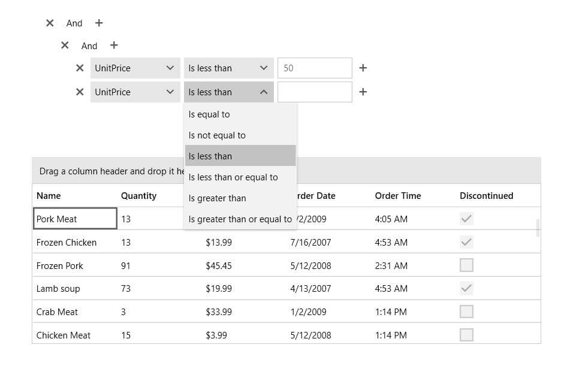

# Overview

## 

Thank you for choosing __RadDataFilter__!
        

Building complex filter expressions in a breeze with Telerik __DataFilter__. The control allows specifying expressions based on the data and collection type of the source fields. The intuitive UI of the control is designed to facilitate the end-user while empowering the developer to create related expressions with a few clicks.
        

In this video we will look at some of the features and functionality of __RadDataFilter__ and how you can start using it in your Silverlight or WPF applications today.[(Runtime: 03:35)](http://tv.telerik.com/watch/silverlight/introduction-to-raddatafilter)

__RadDataFilter__ key features include:
        

* __WPF/Silverlight Code Compatibility__

* __Visual Expression Building__ - with the extremely intuitive UI, __RadDataFilter__ is very user-friendly. Select your filter options with a simple point-and-click. The control allows specifying expressions based on the data and collection type of the source. You can build complex expressions on multiple fields with And/Or operators and myriad of filter functions.
            

* __Seamless Integration__ - __RadDataFilter__ can communicate with any kind of collections (even a plain IEnumerable). The control can then be bound to any ItemsControls (GridView, TreeListView, ComboBox, TreeView etc.) to the filtered endpoint called __FilteredSource__. This allows extreme flexibility and loose coupling.
            

Do not miss the online demos at:[http://demos.telerik.com/silverlight/#DataFilter/FirstLook](http://demos.telerik.com/silverlight/#DataFilter/FirstLook)[http://demos.telerik.com/wpf/?DataFilter/FirstLook](http://demos.telerik.com/wpf/?DataFilter/FirstLook)

# See Also

 * [Visual Structure]()

 * [Getting Started]()

 * [End User Manual]()

 * [Styles and Templates - Overview]()
