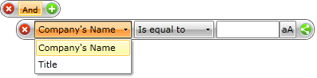
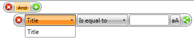

# Data Annotations

By default the __RadDataFilter__ will use each of the fields provided by the underlying business object and will directly use the name of the member. If you have a scenario in which to allow the user to filter the data only by specific members and also to give them user friendly names, you have to use data annotations.

>In order to use the data annotations you have to add a reference to the __System.ComponentModel.DataAnnotations.dll__ in your project.

In this case you can use the __Display__ attribute and set the __AutoGenerateFilter__ and __ShortName__ data annotations in it. Here is an example for a __Person__ class, which exposes __Name__, __CompanyName__ and __Title__ properties. In this case the user is allowed only to filter by the __CompanyName__ and the __Title__ properties. Its display name is also changed to 'Company's Name'.

__Defining class Person__

```C# 
	public class Person
	{
	    [Display( AutoGenerateFilter = false )]
	    public string Name
	    {
	        get;
	        set;
	    }
	    [Display( ShortName = "Company's Name" )]
	    public string CompanyName
	    {
	        get;
	        set;
	    }
	    public string Title
	    {
	        get;
	        set;
	    }
	}
```
```VB.NET

	Public Class Person
	 <Display(AutoGenerateFilter = False)> _
	 Public Property Name() As String
	  Get
	   Return m_Name
	  End Get
	  Set
	   m_Name = Value
	  End Set
	 End Property
	 Private m_Name As String
	 <Display(ShortName = "Company's Name")> _
	 Public Property CompanyName() As String
	  Get
	   Return m_CompanyName
	  End Get
	  Set
	   m_CompanyName = Value
	  End Set
	 End Property
	 Private m_CompanyName As String
	 Public Property Title() As String
	  Get
	   Return m_Title
	  End Get
	  Set
	   m_Title = Value
	  End Set
	 End Property
	 Private m_Title As String
	End Class
```

If you filter a collection of __Person__ objects via the __RadDataFilter__ control, in the DropDown for the Data Members you should see the following:

Figure 1: RadDataFilter displaying all the members to filter on.


You can customize Members shown in the ComboBox with available members to filter on (PART_SimpleFilterMemberComboBox) by specifying whether a property should be displayed or not via __BrowsableAttribute__.

For example, you can apply the attribute like so:

__Setting a property to not be displayed__

```C#	
	[Browsable(false)]
	[Display(ShortName = "Company's Address")]
	public string CompanyAddress
	{
	    get;
	    set;
	}
```

Figure 2: RadDataFilter displaying the Browsable members.



## See Also

 * [Getting Started]()

 * [Source and Filtered Source]()

 * [Unbound Mode]()
