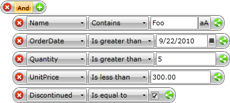

# Filter Editors

The FilterEditors allow the users to input the value of their filter criteria in the __RadDataFilter__. This topic will make you familiar with the following:

* [Built-in Filter Editors](#Built-in_Filter_Editors)

* [Custom Filter Editors](#Custom_Filter_Editors)

## Built-in Filter Editors

When you set the __Source__ property of __RadDataFilter__ it will examine the data source and will create the proper editors depending on the type of each property.

The following list shows the default editors of different types of data:

* __String__ - the default editor is a __TextBox__ with an option to turn on/off the case sensitivity.

* __Date__ - the default editor is a __Calendar.__

* __Numeric__ - the default editor is a __TextBox.__

* __Boolean__ - the default editor is a __CheckBox.__

         
      

You can see a running demo [here](http://demos.telerik.com/silverlight/#DataFilter/DefaultEditors)
          . 

## Custom Filter Editors

If you want to specify a custom filter editor you can do that by using the __EditorTemplateSelector__ property of the control. Once the editor (custom or default) has been created you can add the final touch to it by attaching to the __EditorCreated__ event. A full example can be found [here]().

You can see a running demo [here](http://demos.telerik.com/silverlight/#DataFilter/CustomEditors)
          . 

# See Also

 * [Getting Started]()

 * [Filter Descriptors]()

 * [Source and Filtered Source]()
