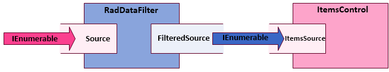

# Source and Filtered Source


The most important property of the __RadDataFilter__ is its __Source__ property. This is where you pass in your collection of data for paging.

The __Source__ property of the __RadDataFilter__ is of type __IEnumerable__, which means that it can theoretically filter any collection. However, the generic type of your collection should expose properties, which to serve as filter members. This means that you can filter collections with a generic type __int__, __string__ etc.

On the picture below you can see the flow of the collection you want to filter.
  

When you assign an [IEnumerable](http://msdn.microsoft.com/en-us/library/system.collections.ienumerable.aspx) as the __Source__ of a __RadDataFilter__ it will automatically expose it through its __FilteredSource__ property. From then on, you can attach any number of __ItemsControls__ to the __FilteredSource__ and they will automatically display the filtered data. Here is demonstrated how to do this entirely in XAML.

#### __XAML__

```XAML

	<telerik:RadDataFilter x:Name="radDataFilter" />
	<telerik:ListBox x:Name="listBox"
	                    ItemsSource="{Binding FilteredSource, ElementName=radDataFilter}"
	                    DisplayMemberPath="Name" />
	```


## See Also

 * [Getting Started]()

 * [Data Annotations]()

 * [Filter Descriptors]()
