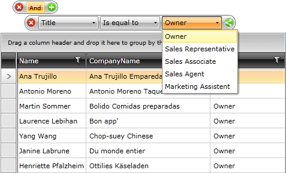

# Create Custom Filter Editors


>You can find a running demo [here](https://demos.telerik.com/silverlight/#DataFilter/CustomEditors)

>You can find the complete source code used in this article in the __Custom Filter Editors__ example of the [Telerik WPF Demos](https://demos.telerik.com/wpf) application.
>. 

If you want to specify a custom filter editor you can do it by using the __EditorTemplateSelector__ property of the control. Once the editor (custom or default) is created, you can add the final touch to it by attaching to the __EditorCreated__ event.

>Note that this approach can be used to create a custom editor of any kind!

This topic will show you how to use a __RadComboBox__ as a filter editor. For this purpose you have to create two classes:

* __EditorTemplateRule__ - this class is used to associate a particular __DataTemplate__ with a filtering member.

* __EditorTemplateSelector__ - this class will represent the actual template selector. It should inherit the __DataTemplateSelector__ class and override its __SelectTemplate()__ method. It also should contain a collection of __EditorTemplateRule__ objects.
In the override for the __SelectTemplate()__ method you should iterate the collection of __EditorTemplateRule__ objects and return the __DataTemplate__ appropriate for the currently created editor.

>At the end of the topic you can find the code for the __Employee__ business object used in this example and some sample data of this type.

In XAML you have to create an instance of the selector, define its rules collection and set it to __RadDataFilter__. Also you have to attach an event handler for __RadDataFilter's EditorCreated__ event. In it you can add your final touches to the editor. In this example this will be represented by populating __RadComboBox__ with items. If you take a look at the defined rule, you can see that the __Title__ property has been associated with the __ComboBoxEditor__ template. This means that whenever the __Title__ is selected as a filtering member __RadComboBox__ editor will appear.

>In order to make the filtering possible, you have to bind the value property of the control that you are using to the __Value__ property of the __DataTemplate's DataContext__ by using a __TwoWay__ binding mode. In this case this is the __SelectedValue__ property.

>In order to set the case sensitivity, you have to bind the __IsCaseSensitive__ property of the DateTemplate’s DataContext, also using a two-way binding.
          
#### __XAML__

```XAML

	<UserControl.Resources>
	    <DataTemplate x:Key="ComboBoxEditor">
	        <telerik:RadComboBox SelectedValue="{Binding Value, Mode=TwoWay}"
	                                MinWidth="100" />
	    </DataTemplate>
	    <local:EditorTemplateSelector x:Key="EditorTemplateSelector">
	        <local:EditorTemplateSelector.EditorTemplateRules>
	            <local:EditorTemplateRule PropertyName="Title"
	                                        DataTemplate="{StaticResource ComboBoxEditor}" />
	        </local:EditorTemplateSelector.EditorTemplateRules>
	    </local:EditorTemplateSelector>
	</UserControl.Resources>
	<Grid x:Name="LayoutRoot"
	        Background="White">
	    <Grid.RowDefinitions>
	        <RowDefinition Height="Auto" />
	        <RowDefinition />
	    </Grid.RowDefinitions>
	    <telerik:RadDataFilter x:Name="radDataFilter"
	                            EditorTemplateSelector="{StaticResource EditorTemplateSelector}"
	                            EditorCreated="radDataFilter_EditorCreated" />
	    <telerik:RadGridView x:Name="radGridView"
	                            ItemsSource="{Binding FilteredSource, ElementName=radDataFilter}"
	                            AutoGenerateColumns="False"
	                            Grid.Row="1">
	        <telerik:RadGridView.Columns>
	            <telerik:GridViewDataColumn DataMemberBinding="{Binding Name}" />
	            <telerik:GridViewDataColumn DataMemberBinding="{Binding CompanyName}" />
	            <telerik:GridViewDataColumn DataMemberBinding="{Binding Title}" />
	        </telerik:RadGridView.Columns>
	    </telerik:RadGridView>
	</Grid>
```

Here is the code behind of the example. The most important thing in it is the event handler for the __EditorCreated__ event. In it you can fill __RadComboBox__ editor with the desired data. 

As you can see by using the switch statement you can extend the logic for additional custom editors by adding more cases.

#### __C#__

```C#

	public partial class CustomFilterEditorsSample : UserControl
	{
	    public CustomFilterEditorsSample()
	    {
	        InitializeComponent();
	        this.radDataFilter.Source = SampleData.GetEmployees();
	    }
	    private void radDataFilter_EditorCreated( object sender, EditorCreatedEventArgs e )
	    {
	        switch ( e.ItemPropertyDefinition.PropertyName )
	        {
	            case "Title":
	                ( ( RadComboBox )e.Editor ).ItemsSource = this.GetTitles();
	                break;
	        }
	    }
	    public  List<string> GetTitles()
	    {
	        return new List<string>() { "Owner", "Sales Representative", "Sales Associate", "Sales Agent", "Marketing Assistent" };
	    }
	}
	```


#### __VB.NET__

```VB.NET

	Public Partial Class CustomFilterEditorsSample
	 Inherits UserControl
	 Public Sub New()
	  InitializeComponent()
	  Me.radDataFilter.Source = SampleData.GetEmployees()
	 End Sub
	 Private Sub radDataFilter_EditorCreated(sender As Object, e As EditorCreatedEventArgs)
	  Select Case e.ItemPropertyDefinition.PropertyName
	   Case "Title"
	    DirectCast(e.Editor, RadComboBox).ItemsSource = Me.GetTitles()
	    Exit Select
	  End Select
	 End Sub
	 Public Function GetTitles() As List(Of String)
	  Return New List(Of String)() With { _
	   "Owner", _
	   "Sales Representative", _
	   "Sales Associate", _
	   "Sales Agent", _
	   "Marketing Assistent" _
	  }
	 End Function
	End Class
	```


Here is a snapshot of the final result:



Here is the code for the Employee object and the sample data.

#### __C#__

```C#

	public class Employee
	{
	    public Employee( string name, string companyName, string title )
	    {
	        this.Name = name;
	        this.CompanyName = companyName;
	        this.Title = title;
	    }
	    public string Name
	    {
	        get;
	        set;
	    }
	    public string CompanyName
	    {
	        get;
	        set;
	    }
	    public string Title
	    {
	        get;
	        set;
	    }
	}
	```


#### __VB.NET__

```VB.NET

	Public Class Employee
	 Public Sub New(name As String, companyName As String, title As String)
	  Me.Name = name
	  Me.CompanyName = companyName
	  Me.Title = title
	 End Sub
	 Public Property Name() As String
	  Get
	   Return m_Name
	  End Get
	  Set
	   m_Name = Value
	  End Set
	 End Property
	 Private m_Name As String
	 Public Property CompanyName() As String
	  Get
	   Return m_CompanyName
	  End Get
	  Set
	   m_CompanyName = Value
	  End Set
	 End Property
	 Private m_CompanyName As String
	 Public Property Title() As String
	  Get
	   Return m_Title
	  End Get
	  Set
	   m_Title = Value
	  End Set
	 End Property
	 Private m_Title As String
	End Class
	```


#### __C#__

```C#

	ObservableCollection<Employee> employees = new ObservableCollection<Employee>();
	employees.Add( new Employee( "Maria Anders", "Alfreds Futterkiste", "Sales Representative" ) );
	employees.Add( new Employee( "Ana Trujillo", "Ana Trujillo Emparedados y helados", "Owner" ) );
	employees.Add( new Employee( "Antonio Moreno", "Antonio Moreno Taqueria", "Owner" ) );
	employees.Add( new Employee( "Thomas Hardy", "Around the Horn", "Sales Representative" ) );
	employees.Add( new Employee( "Hanna Moos", "Blauer See Delikatessen", "Sales Representative" ) );
	employees.Add( new Employee( "Frederique Citeaux", "Blondesddsl pere et fils", "Marketing Manager" ) );
	employees.Add( new Employee( "Martin Sommer", "Bolido Comidas preparadas", "Owner" ) );
	employees.Add( new Employee( "Laurence Lebihan", "Bon app'", "Owner" ) );
	employees.Add( new Employee( "Elizabeth Lincoln", "Bottom-Dollar Markets", "Accounting manager" ) );
	employees.Add( new Employee( "Victoria Ashworth", "B's Beverages", "Sales representative" ) );
	```


#### __VB.NET__

```VB.NET

	Dim employees As New ObservableCollection(Of Employee)()
	employees.Add(New Employee("Maria Anders", "Alfreds Futterkiste", "Sales Representative"))
	employees.Add(New Employee("Ana Trujillo", "Ana Trujillo Emparedados y helados", "Owner"))
	employees.Add(New Employee("Antonio Moreno", "Antonio Moreno Taqueria", "Owner"))
	employees.Add(New Employee("Thomas Hardy", "Around the Horn", "Sales Representative"))
	employees.Add(New Employee("Hanna Moos", "Blauer See Delikatessen", "Sales Representative"))
	employees.Add(New Employee("Frederique Citeaux", "Blondesddsl pere et fils", "Marketing Manager"))
	employees.Add(New Employee("Martin Sommer", "Bolido Comidas preparadas", "Owner"))
	employees.Add(New Employee("Laurence Lebihan", "Bon app'", "Owner"))
	employees.Add(New Employee("Elizabeth Lincoln", "Bottom-Dollar Markets", "Accounting manager"))
	employees.Add(New Employee("Victoria Ashworth", "B's Beverages", "Sales representative"))
```
