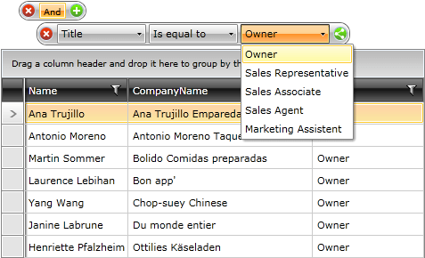

# Create Custom Filter Editors

If you want to specify a custom filter editor you can do it by using the `EditorTemplateSelector` property of the control. Once the editor (custom or default) is created, you can add the final touch to it by attaching to the `EditorCreated` event.

>Note that this approach can be used to create a custom editor of any kind!

This topic will show you how to use a `RadComboBox` as a filter editor. For this purpose you have to create two classes:

* `EditorTemplateRule`&mdash;this class is used to associate a particular `DataTemplate` with a filtering member.
* `EditorTemplateSelector`&mdash;this class will represent the actual template selector. It should inherit the `DataTemplateSelector` class and override its `SelectTemplate` method. It also should contain a collection of EditorTemplateRule objects.
In the override for the SelectTemplate method you should iterate the collection of EditorTemplateRule objects and return the DataTemplate appropriate for the currently created editor.

>At the end of the topic you can find the code for the `Employee` business object used in this example and some sample data of this type.

In XAML you have to create an instance of the selector, define its rules collection and set it to `RadDataFilter`. Also you have to attach an event handler for `RadDataFilter's EditorCreated` event. In it you can add your final touches to the editor. In this example this will be represented by populating `RadComboBox` with items. If you take a look at the defined rule, you can see that the `Title` property has been associated with the `ComboBoxEditor` template. This means that whenever the `Title` is selected as a filtering member `RadComboBox` editor will appear.

>In order to make the filtering possible, you have to bind the value property of the control that you are using to the `Value` property of the DataTemplate's `DataContext` by using a `TwoWay` binding mode. In this case this is the `SelectedValue` property.

>In order to set the case sensitivity, you have to bind the `IsCaseSensitive` property of the DateTemplate’s DataContext, also using a two-way binding.

<snippet id='raddatafilter-how-to-create-custom-filter-editors-block_1-xaml' />

Below is the implementation of the `EditorTemplateRule` class.

<snippet id='raddatafilter-how-to-create-custom-filter-editors-block_2-cs' />

<snippet id='raddatafilter-how-to-create-custom-filter-editors-block_2-vb' />

Below is the implementation of the `MyEditorTemplateSelector` class.

<snippet id='raddatafilter-how-to-create-custom-filter-editors-block_3-cs' />

<snippet id='raddatafilter-how-to-create-custom-filter-editors-block_3-vb' />

Here is the code behind of the example. The most important thing in it is the event handler for the `EditorCreated` event. In it you can fill RadComboBox editor with the desired data. 

As you can see by using the switch statement you can extend the logic for additional custom editors by adding more cases.

<snippet id='raddatafilter-how-to-create-custom-filter-editors-block_4-cs' />

<snippet id='raddatafilter-how-to-create-custom-filter-editors-block_4-vb' />

Here is a snapshot of the final result:

Here is the code for the Employee object and the sample data.

<snippet id='raddatafilter-how-to-create-custom-filter-editors-block_5-cs' />

<snippet id='raddatafilter-how-to-create-custom-filter-editors-block_5-vb' />

<snippet id='raddatafilter-how-to-create-custom-filter-editors-block_6-cs' />

<snippet id='raddatafilter-how-to-create-custom-filter-editors-block_6-vb' />

>You can find the complete source code used in this article in the __Custom Filter Editors__ example of the [Telerik WPF Demos](https://demos.telerik.com/wpf) application.