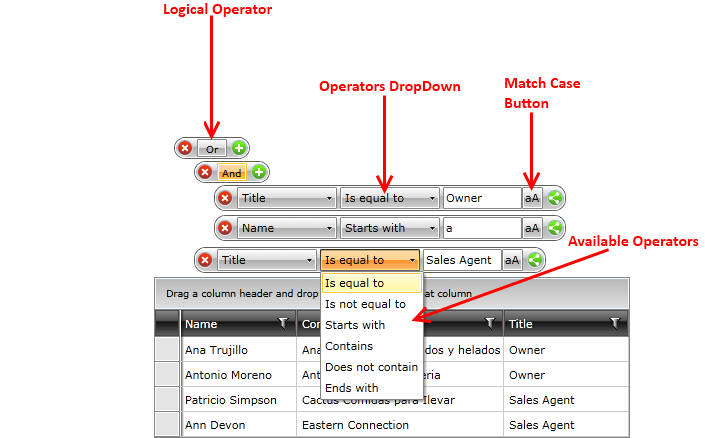

# Localization

The built-in localization mechanism in WPFSilverlight allows you to localize __RadDataFilter__ control.
      
Here is a list of the supported languages:
      
* English            
* German          
* Spanish           
* French
* Italian              
* Dutch             
* Turkish

>To learn more about the ways to localize the RadControls please read the common topic about 
   [Localization](http://www.telerik.com/help/silverlight/common-localization.html)[Localization](http://www.telerik.com/help/wpf/common-localization.html).

Below you may see some of the resource keys and the strings they are associated with them.

## Resource Keys

The resources of the control can be localized by using an unique identifier called resource key that is assigned to each localizable string. Below you may find a list of all Resources available and their default values:

<table> <tr>KeyValue</tr><tr><td>FilterAnd</td><td>And</td></tr><tr><td>FilterContains</td><td>Contains</td></tr><tr><td>FilterDoesNotContain</td><td>Does not contain</td></tr><tr><td>FilterEndsWith</td><td>Ends with</td></tr><tr><td>FilterIsContainedIn</td><td>Is contained in</td></tr><tr><td>FilterIsEqualTo</td><td>Is equal to</td></tr><tr><td>FilterIsGreaterThan</td><td>Is greater than</td></tr><tr><td>FilterIsGreaterThanOrEqualTo</td><td>Is greater than or equal to</td></tr><tr><td>FilterIsLessThan</td><td>Is less than</td></tr><tr><td>FilterIsLessThanOrEqualTo</td><td>Is less than or equal to</td></tr><tr><td>FilterIsNotContainedIn</td><td>Is not contained in</td></tr><tr><td>FilterIsNotEqualTo</td><td>Is not equal to</td></tr><tr><td>FilterMatchCase</td><td>Match case</td></tr><tr><td>FilterOr</td><td>Or</td></tr><tr><td>FilterStartsWith</td><td>Starts with</td></tr><tr><td>FilterIsEmpty</td><td>Is empty</td></tr><tr><td>FilterIsNotEmpty</td><td>Is not empty</td></tr><tr><td>FilterIsNull</td><td>Is null</td></tr><tr><td>FilterIsNotNull</td><td>Is not null</td></tr></table>
