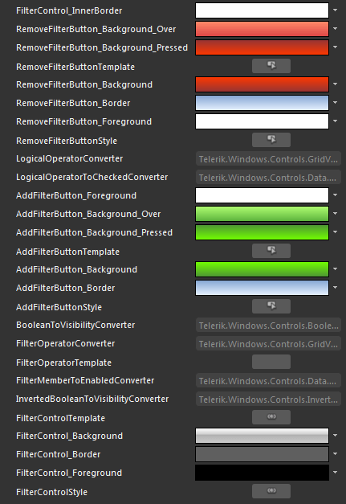

# Styling the FilterControl

>Before reading this topic, you might find it useful to get familiar with the [Template Structure of the FilterControl]().
        

The __FilterControl__ exposes a __Style__ property which allows you to apply a style to it and modify its appearance.
      

## Modifying the Default Style

Using [Implicit Styles]() gives you the ability to easily extract and edit the default ControlTemplates of the controls. You can follow the article on [different approaches on how to extract the ControlTemplates]().

* **FilterControl_InnerBorder** a brush, that represents the color of the inner border of the __FilterControl__.
            

*  **RemoveFilterButton_Background_Over** - a brush, that represents the background color of the __Delete__ button, when the mouse is over it.
            

* **RemoveFilterButton_Background_Pressed** - a brush, that represents the background color of the __Delete__ button, when it gets clicked.
            

* __RemoveFilterButtonTemplate__ - the __ControlTemplate__ for the __RadButton__ control, that represents the __Delete__ button.
            

* **RemoveFilterButton_Background** - a brush, that represents the background color of the __Delete__ button
            

* **RemoveFilterButton_Border** - a brush that represents the border color of the __Delete__ button.
            

* **RemoveFilterButton_Foreground** - a brush, that represent the foreground color of the __Delete__ button.
            

* __RemoveFilterButtonStyle__- the Style for the RadButton, that represents the __Delete__ button.
            

* **AddFilterButton_Foreground** - a brush, that represents the foreground color of the __Add New Criteria__ and __Add Nested Operator__ button.
            

* **AddFilterButton_Background_Over** - a brush, that represents the background color of the __Add New Criteria__ and __Add Nested Operator__ button, when the mouse is over it.
            

* __AddFilterButton_Background_Pressed__ - a brush, that represents the background color of the __Add New Criteria__ and __Add Nested Operator__ button, when it gets clicked.
            

* __AddFilterButtonTemplate__ - the ControlTemplate for the __Add New Criteria__ and __Add Nested Operator__ button.
            

* **AddFilterButton_Background** - a brush, that represents the background color of the __Add New Criteria__ and __Add Nested Operator__ button.
            

* **AddFilterButton_Border** - a brush, that represents the border color of the __Add New Criteria__ and __Add Nested Operator__ button.
            

* __AddFilterButtonStyle__ - the style applied to the __Add New Criteria__ and __Add Nested Operator__ button.
            

* __FilterOperatorTemplate__ - represents the DataTemplate for the drop down with the available filter operators.
            

* __FilterControlTemplate__ - the ControlTemplate for the FilterControl.
            

* **FilterControl_Background** - a brush, that represents the __background__ color of the __FilterControl__.
            

* **FilterControl_Border** - a brush, that represents the border color of the __FilterControl__.
            

* **FilterControl_Foreground** - a brush, that represents the foreground color of the __FilterControl__.
            

* __FilterControlStyle__ - the __Style__ for the __FilterControl__.
            

After finishing with your modification you have to set the __Style__ for the __FilterControl__ to its instances inside the __RadDataFilter__. To see how to do it, read the [Styling the RadDataFilter]() topic.
        

# See Also

 * [Template Structure]()

 * [Styling the RadDataFilter]()
