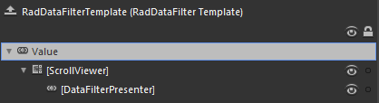
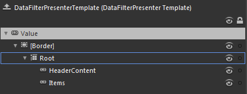
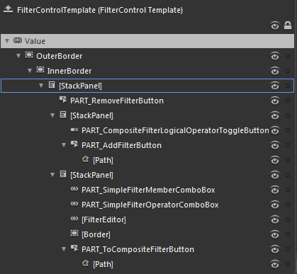

# Template Structure

Like most controls, the __RadDataFilter__ also allows you to template it in order to change the control from the inside. Except for templating the whole control, you can also template only parts of it. This topic will make you familiar with the template structures of the:
      

* [RadDataFilter](40A684F2-83E5-4F3F-83E0-72359B8E802D#raddatafilter)

* [DataFilterPresenter](40A684F2-83E5-4F3F-83E0-72359B8E802D#RadDataFilter#DataFilterPresenter)

* [FilterControl](40A684F2-83E5-4F3F-83E0-72359B8E802D#RadDataFilter#FilterControl)

>For more information about templating and how to modify the default templates of the __RadControls__ read the article on [different approaches on how to extract the ControlTemplates]().
        

## RadDataFilter

* __[ScrollViewer]__ - wraps the elements of the __RadDataFilter's__ template and enables scrolling, when the __RadDataFilter__ exceeds the available space. It is of type __ScrollViewer__.
            

* __[DataFilterPresenter]__ - represents the control that wraps the visual elements of the __RadDataFilter__. It is of type __DataFilterPresenter__ and inherits the __HeaderedItemsControl__.
            

## DataFilterPresenter

* __[Border]__

* __Root__ - layouts the elements of the __DataFilterPresenter's__ template.
            

* __HeaderContent__ - displays the header of the __DataFilterPresenter__ and is of type __ContentControl__.
            

* __Items__ - displays the items of the __DataFilterPresenter__ and is of type __ItemsPresenter__.
            

## FilterControl

* __OuterBorder__ - represents the color of the outer border of the __FilterControl__ and is of type __Border__.
            

* __InnerBorder__ - represents the inner border and the background of the __FilterControl__ and is of type __Border__.
            

* __[StackPanel]__ - layouts the visual elements of the __FilterControl__ and is of type __StackPanel__.
            

* __PART_RemoveFilterButton__ - represents the delete button and is of type __RadButton__.
            

* __[StackPanel]__ - layouts the visual elements for the composite filter and is of type __StackPanel__.
            

* __PART_CompositeFilterLogicalOperatorToggleButton__ - represents the toggle button for the logical operator of the composite filter and is of type __RadToggleButton__.
            

* __PART_AddFilterButton__ - represents the button for adding new filter criteria and is of type __RadButton__.
            

* __[Path]__ - represents the shape inside the button and is of type __Path__.
            

* __[StackPanel]__ - layouts the visual elements for the simple filter and is of type __StackPanel__.
            

* __PART_SimpleFilterMemberComboBox__ - represents the drop down for the available members and is of type __RadComboBox__.
            

* __PART_SimpleFilterOperatorComboBox__ - represents the drop down for the available filter operators and is of type __RadComboBox__.
            

* __[FilterEditor]__ - represents the element for the user's input and is of type __FilterEditor__.
            

* __[Border]__

* __PART_ToCompositeFilterButton__ - represents the button for creating nested filter criteria and is of type __RadButton__.
            

* __[Path]__ - represents the shape inside the button and is of type __Path__.
            

# See Also

 * [Visual Structure]()

 * [Styling the RadDataFilter]()

 * [Styling the FilterControl]()
