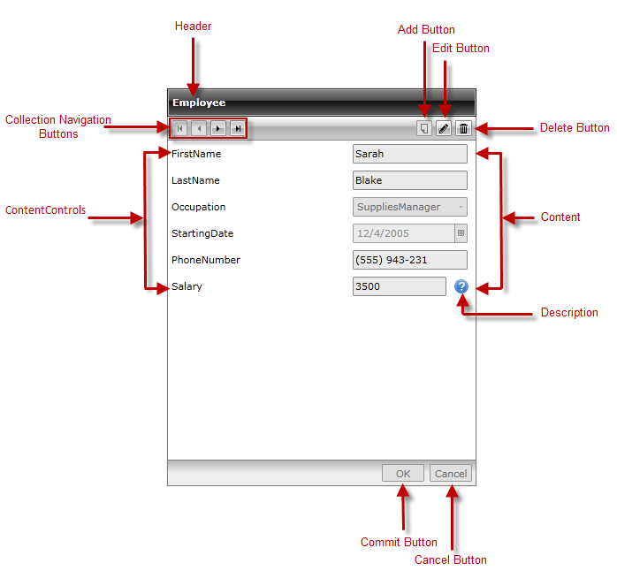

# Visual Structure

## 

__RadDataForm__ allows you to easily display, update and navigate through data. It is mainly focused on the single item itself and enables editing, removing or adding a new one. 

This section defines the terms and concepts used in the scope of the __RadDataForm__ that you have to get familiar with prior to continue reading this help. They can also be helpful when contacting with the support service in order to better describe your issue. Below you can see snapshot and explanations of the main states and visual elements of the standard __RadDataForm__ control.

 

* __Header__ - enables you to set the appropriate header for the RadDataForm 

* __Collection Navigation Buttons__ - enable running through the items - either with a single step back and forth or by jumping to the first or last item;

* __Add Button__ - allows you to insert a new item into the collection;

* __Edit Button__ - allows you to edit the currently displayed item;

* __Delete Button__ - allows you to delete the currently displayed item;

* __Data Fields__ - allows updating the fields of the specific item;

* __DataFormCheckBoxField__ - used for editing of boolean properties;

* __DataFormComboBoxField__ - used for editing by choosing a value from predefined data source;

* __DataFormDataField__ - used for editing of string properties;

* __DataFormDateField__ - used for editing properties of type DateTime;

* __Commit Button__ - saves the changes made to the current item;

* __Cancel Button__ - reverts the changes made to the current item;     
