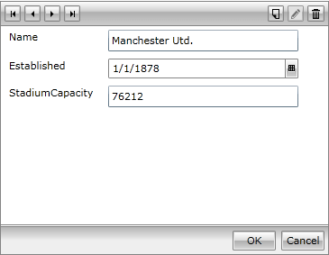
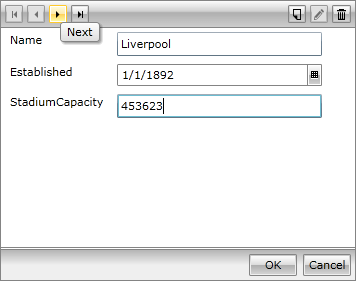
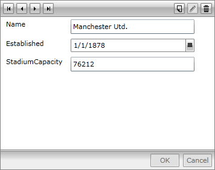
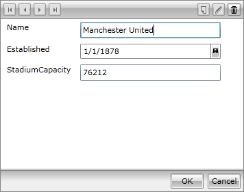

# AutoCommit Settings

__RadDataForm__ exclusively relies on data binding, so __changes are actually committed when the respective bindings push the changes back__ to their sources, so that the term __“Commit” actually refers to a confirmation__ that processed data has passed all the validation checks and the user is willing to end the editing operation, persisting edited item’s current state. On the other hand __“Cancel” (when it is available) would make the state revert to item’s initial one__. This article describes RadDataForm’s two alternating behaviors of committing pending changes.
     


>As of Q2 2014 SP we introduced cancel support for ExpandoObject.
  


## AutoCommit is True

The default value of RadDataForm’s __AutoCommit property is True__. In this mode RadDataForm automatically commits any changes on the current item, when a command different from Delete or Cancel is carried out. Here is an example:
        

 AutoCommit example 1

 

When entering edit mode (i.e. when the __AutoCommit is True), all commands, but BeginEdit are enabled__.
        

AutoCommit example 2

__Applying changes__ on the current item keeps the commands enabled. __Moving to the next item__ will automatically commit the current edit operation.
        

## AutoCommit is False

__Please, be advised that the following changes regarding AutoCommit = false are available after the 2012 Q1 Service Pack version of the RadControls.__ RadDataForm requires its business type to implement __INotifyPropertyChanged__, in order to utilize this mode properly. In case the mentioned interface is not implemented, the control falls back to its default behavior. RadDataForm with AutoCommit = false mode forces its users to commit any changes, by using the CommitEdit command (the Ok button). The commands for Cancel, Delete and OK are enabled if there are any present uncommitted changes. In that case all the other commands are disabled. And here comes the example:       

AutoCommit example 3

When entering edit mode, the __Commit and Cancel commands are initially disabled__, as there are no pending changes to commit or cancel. On the other hand, __all the other commands are enabled__.
        

AutoCommit example 4

__When changes are applied, the Navigation and AddNew commands get disabled__, until the editing operation is committed, or cancelled.
        

>As TextBox’s Text property binding is triggered on control’s LostFocus, __any UI initiated modifications are considered changes__, even before the respective property value is updated.
            Users’ experience should not vary when different AutoEdit options are used alongside with any of the AutoCommit modes.
          
